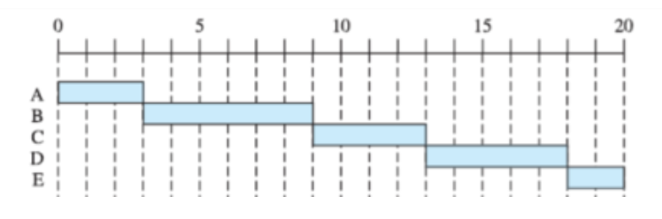

# CPU 스케줄링 알고리즘

> 운영 체제에서 여러 프로세스를 효율적으로 실행하기 위해 **CPU 시간을 할당하는 방법을 결정하는 알고리즘**이다. 이를 통해 시스템의 성능을 최적화하고, 프로세스 간의 공정성을 유지하며, 응답 시간을 최소화하는 등의 목표를 달성할 수 있다.
> 

## ✅ 비선점형 방식

> 현재 실행 중인 프로세스가 **자발적으로 종료되거나, 입출력 작업을 위해 대기 상태로 전환될 때까지** CPU를 계속 사용한다. 운영 체제가 임의로 프로세스를 중단시킬 수 없다.
> 

### ✒️ FCFS

> 도착한 순서대로 프로세스에 CPU를 할당한다.
> 



FCFS

- 장점 → 구현이 매우 간단하고 이해하기 쉽다.
- 단점 → `Convoy` 효과로 인해 평균 대기 시간이 길어질 수 있다.
    - **💡Convoy 효과?**
        
        > 실행 시간이 긴 프로세스가 CPU를 점유하고 있는 동안, 뒤에 대기하고 있는 짧은 프로세스들이 계속해서 기다려야 하는 상황을 의미한다.
        > 
        
        convoy 효과를 완화하기 위해 다른 스케줄링 알고리즘이 사용된다.
        

### ✒️ SJF

> 실행 시간이 가장 짧은 프로세스에 CPU를 할당한다.
> 


SJF

- 장점 → 평균 대기 시간을 최소화할 수 있다.
- 단점 → 실행 시간을 미리 알기 어렵고, 기아 문제가 발생할 수 있다.

### ✒️ 우선순위

> 프로세스가 종료되거나 대기 상태로 전환될 때까지 우선순위가 가장 높은 프로세스에 CPU를 할당한다.
> 


Priority

- 장점 → 중요한 작업을 처리할 수 있다.
- 단점 → 기아 문제가 발생할 수 있다.

---

## ✅ 선점형 방식

> 운영 체제가 **현재 실행 중인 프로세스를 중단시키고, 다른 프로세스에 CPU를 할당**할 수 있다. 이는 주로 프로세스의 우선순위가 변경되거나, 특정 이벤트 발생 시 이루어진다.
> 

### ✒️ Round Robin

> 일정한 시간 할당량(`time quantum`)마다 프로세스를 전환한다.
> 


Round Robin

- 장점 → 공정성과 빠른 응답 시간을 보장한다.
- 단점 → 적절한 시간 할당량을 설정하는 것이 중요하다. 너무 짧으면 문맥 교환 오버헤드가 증가하고, 너무 길면 FCFS와 유사해질 수 있다.

### ✒️ SRF

> 실행 시간이 가장 적게 남은 프로세스에 CPU를 할당한다.
> 
- 장점 → 평균 대기 시간을 최소화할 수 있다.
- 단점 → 실행 시간을 미리 알기 어렵고, 기아 문제가 발생할 수 있다.

### ✒️ 다단계 큐

> 프로세스의 CPU 사용 시간에 따라 우선순위가 동적으로 변경되며, 큐 간 이동이 가능하다.
> 


다단계 큐

- 장점 → 유연성과 공정성을 제공하며, 다양한 작업을 효과적으로 처리할 수 있다.
- 단점 →  설정이 복잡하고 많은 튜닝이 필요하다.

## 🌿 스프링에서의 스케줄링

> 스프링 프레임워크는 작업을 예약하고 실행하기 위한 다양한 스케줄링 기능을 제공한다. `@Scheduled` 어노테이션을 사용하여 정기적으로 실행해야 하는 작업을 간단히 예약할 수 있다.
> 

```java
import org.springframework.scheduling.annotation.Scheduled;
import org.springframework.stereotype.Component;

@Component
public class ScheduledTasks {

		// 5초마다 정기 실행
    @Scheduled(fixedRate = 5000)
    public void performTask() {
        System.out.println("Scheduled task executed every 5 seconds");
    }
}
```

위의 스케줄링을 사용하기 위해서 `ThreadPoolTaskScheduler`를 사용하여 스케줄링 작업을 관리할 수 있도록 빈등록을 해준다.

```java
import org.springframework.context.annotation.Bean;
import org.springframework.context.annotation.Configuration;
import org.springframework.scheduling.concurrent.ThreadPoolTaskScheduler;

@Configuration
public class SchedulerConfig {

    @Bean
    public ThreadPoolTaskScheduler taskScheduler() {
        ThreadPoolTaskScheduler scheduler = new ThreadPoolTaskScheduler();
        scheduler.setPoolSize(10);
        scheduler.setThreadNamePrefix("scheduled-task-");
        return scheduler;
    }
}
```

### 💡언제 사용할까?

> 주기적으로 또는 특정 시점에 실행되어야 하는 작업을 자동으로 수행하기 위해 사용된다. 이를 통해 개발자는 작업을 예약하고 관리할 수 있으며, 이러한 작업은 보통 시스템 유지 관리, 데이터 처리, 보고서 생성 등 다양한 용도로 활용된다.
> 

보통 데이터 동기화에서 쓸 일 많을듯 → **크롤링**이나 **주기적 데이터 갱신이 필요한 경우**?

```java
@Scheduled(fixedRate = 3600000)
public void synchronizeData() {
    // 데이터 동기화 로직
}
```

```java
@Scheduled(fixedDelay = 60000)
public void checkSystemHealth() {
    // 시스템 상태 점검 및 알림 발송 로직
}
```

```java
// cron = "초 분 시 일 월 요일 [연도]"
@Scheduled(cron = "0 0 9 * * ?")
public void sendMarketingEmails() {
    // 이메일 발송 로직
}
```

[Spring Boot - 스케쥴링 태스크](https://assu10.github.io/dev/2023/10/14/springboot-scheduling/)