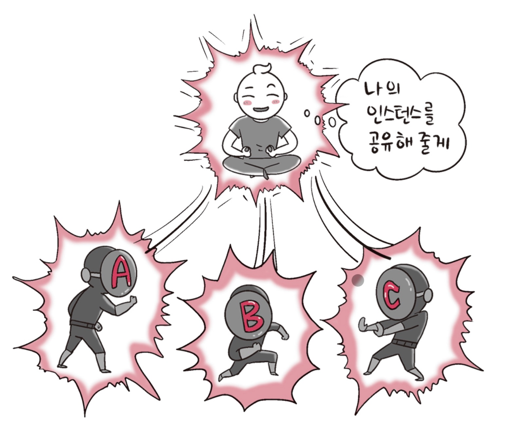
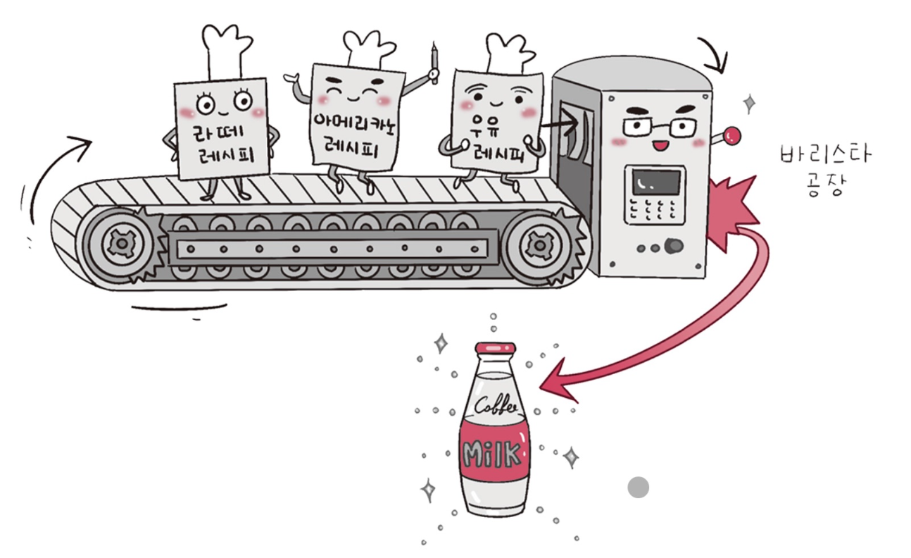
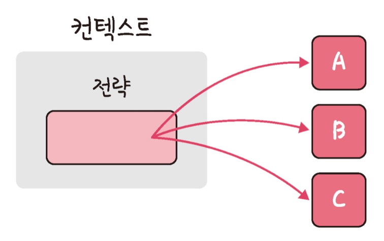
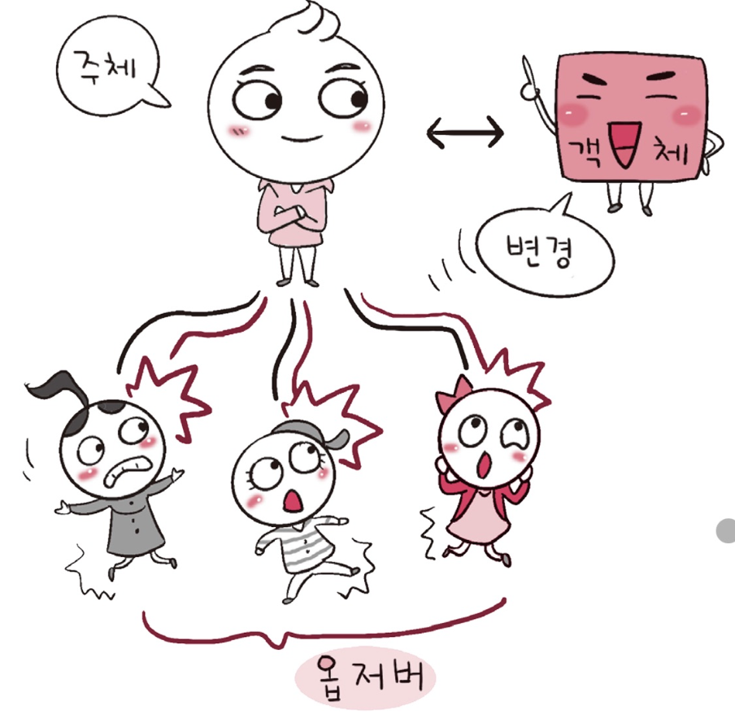
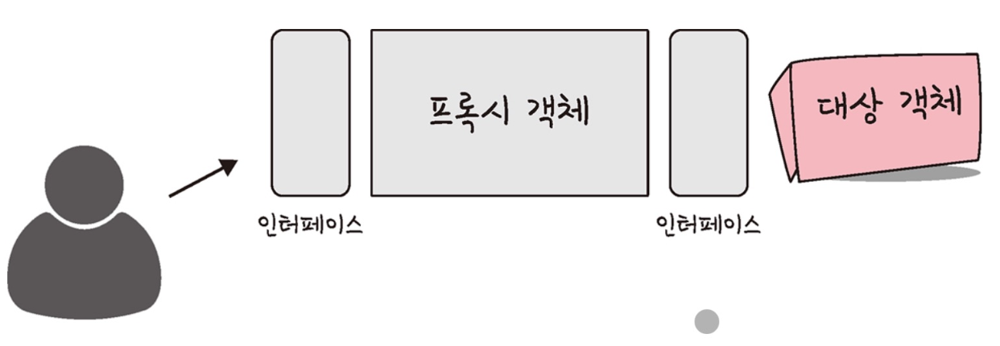
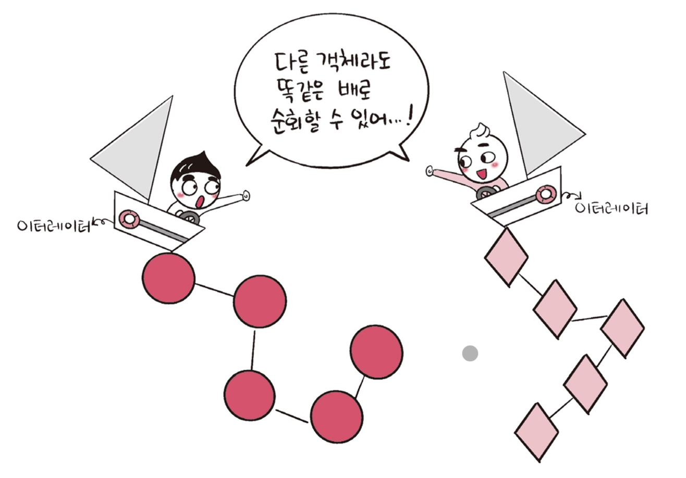
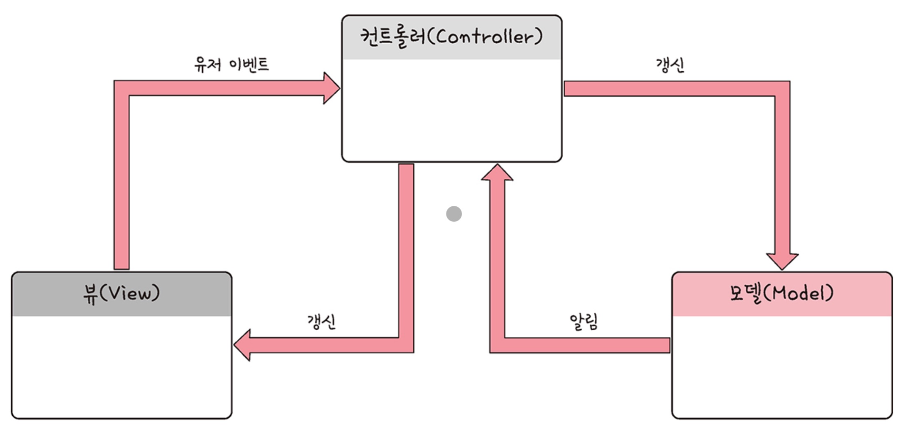

# ⚜️ 디자인 패턴 ⚜️

---

## 📚 싱글톤 패턴


### ☝ 싱글톤 패턴이란?

> **하나의 클래스**에 오직 **하나의 인스턴스**만 가지는 패턴이다. 하나의 클래스를 기반으로 여러 개의 개별적인 인스턴스를 만들 수 있지만, 그렇게 하지 않고 하나의 클래스를 기반으로 단 하나의 인스턴스를 만들어 이를 기반으로 로직을 만드는 데 쓰이며, 보통 DB 연결 모듈에 많이 쓰인다.



- 장점 → 인스턴스 생성 비용 감소
- 단점 → 의존성이 높아짐

---


### ☝ 자바스크립트의 싱글톤 패턴


자바스크립트에서는 리터럴 `{}` 또는 `new Object`로 객체를 생성하게 되면 다른 어떤 객체와도 다르기 때문에 이 자체만으로 싱글톤 패턴을 구현할 수 있다.

```jsx
const obj = { 
	a: 27
}
const obj2 = { 
	a: 27
}
console.log(obj === obj2)
// false
```

위 코드에서 `obj`와 `obj2`는 다른 인스턴스이다. 이 또한 `new Object` 클래스에서 나온 단 하나의 인스턴스이기 때문에 싱글톤 패턴이라 볼 수 있지만, 실제 싱글톤 패턴은 다음과 같이 구성된다.

```jsx
class Singleton {
	constructor () {
		if (!Singleton.instance) {
			Singleton. instance = this 
		}
		return Singleton. instance 
	}
	get Instance () { 
		return this
	} 
}
const a = new Singleton() 
const b = new Singleton()
console.log(a === b) // true
```

위 코드는 `Singleton.instance`라는 하나의 인스턴스를 가지는 `Singleton` 클래스를 구현한 모습이다.

---

### ☝ DB 연결 모듈


```jsx
const URL = 'mongodb://localhost: 27017/kundolapp'
const createConnection = url => ({"url" : url})
class DB { 
	constructor(url) {
		if (!DB.instance) {
			DB.instance = createConnection(url)
		}
		return DB.instance }
		connect(){
			return this.instance
		}
}
const a = new DB(URL)
const b = new DB(URL) 
console.log(a === b) // true
```

위처럼 `DB.instance`라는 하나의 인스턴스를 기반으로 a, b를 생성하여 DB 연결에 관한 인스턴스 생성 비용을 아낄 수 있다.

---


### ☝ 자바에서의 싱글톤 패턴


자바에서는 다음과 같이 중첩 클래스를 이용해서 만드는 방법이 가장 대중적이다.

```java
class Singleton {
    private static class singleInstanceHolder {
        private static final Singleton INSTANCE = new Singleton();
    }

    public static Singleton getInstance() {
        return singleInstanceHolder.INSTANCE;
    }
}

public class HelloWorld {
    public static void main(String[] args) {
        Singleton a = Singleton.getInstance();
        Singleton b = Singleton.getInstance();
        System.out.println(a.hashCode());
        System.out.println(b.hashCode());
        if (a == b) {
            System.out.println(true);
        }
    }
}
/*
705927765 
705927765
true
*/
```

---


### ☝ mongoose의 싱글톤 패턴


실제로 `Node.js`에서 `MongoDB`를 연결할 때 쓰는 `mongoose` 모듈에서 볼 수 있다.


`mongoose`의 DB를 연결할 때 쓰는 `connect()`라는 함수는 싱글톤 인스턴스를 반환합니다. 다음은 `connect()` 함수를 구현할 때 쓰인 실제 코드이다.

```jsx
Mongoose.prototype.connect = function(uri, options, callback) { 
	const _mongoose = this instanceof Mongoose ? this : mongoose;
	const conn = _mongoose.connection;
	return _mongoose._promiseOrCallback(callback, cb => { 
		conn. openUri (uri, options, err => {
			if (err != null) {
				return cb(err); 
			}
			return cb(null, _mongoose); 
		});
	});
};
```

---

### ☝ MySQL의 싱글톤 패턴


`Node.js`에서 `MySQL` DB를 연결할 때도 싱글톤 패턴이 쓰인다.


```jsx
const mysql = require('mysql');
const pool = mysql.createPool({
	connectionLimit: 10,
	host: 'example.org',
	user: 'root',
	password: 'secret',
	database: 'lukeDB'
});
pool.connect();

// 모듈 A
pool.query(query, function (error, results, fields) {
	if (error) throw error;
	console.log('The solution is: ', results[0].solution);
});

// 모듈 B
pool.query(query, function (error, results, fields) {
	if (error) throw error;
	console.log('The solution is: ', results[0].solution);
});
```

위 코드처럼 메인 모듈에서 DB 연결에 관한 인스턴스를 정의하고 다른 모듈인 A 또는 B에서 해당 인스턴스를 기반으로 쿼리를 보내는 형식으로 쓰인다.

---


### ☝ 싱글톤 패턴의 단점


싱글톤 패턴은 `TDD`(Test Driven Development)를 할 때 걸림돌이 된다.

`TDD`를 할 때 단위 테스트를 주로 하는데, 단위 테스트는 테스트가 서로 독립적이어야 하며 테스트를 어떤 순서로든 실행할 수 있어야 한다.

하지만 싱글톤 패턴은 미리 생성된 하나의 인스턴스를 기반으로 구현하는 패턴이므로 각 테스트마다 **‘독립적인’** 인스턴스를 만들기가 힘들다.

---


### ☝ DI (Dependency Injection)


싱글톤 패턴은 사용하기가 쉽고 굉장히 실용적이지만 모듈 간의 **결합을 강하게** 만든다는 단점이 있다.

이때 의존성 주입(DI, Dependency Injection)을 통해 모듈 간의 결합을 조금 더 느슨하게 만들어 해결할 수 있다.


#### 🗒️ **참고**


- 의존성이란 종속성이라고도 하며 A가 B에 의존성이 있다는 것은 B의 변경 사항에 대해 A 또한 변해야 된다는 것을 의미한다.


위 그림처럼 메인 모듈이 **직접** 다른 하위 모듈에 대한 의존성을 주는게 아닌, 중간에 의존성 주입자가 이 부분을 가로채 메인 모듈이 **간접적**으로 의존성을 주입하는 방식이다.

이를 통해 메인 모듈(상위 모듈)은 하위 모듈에 대한 의존성이 떨어진다.
(디커플링 된다)

- 장점

  → 모듈들을 쉽게 교체할 수 있는구조가 되어 테스팅하기 쉽고 마이그레이션하기 수월하다.
  → 의존성 방향이 일관되고, 애플리케이션을 쉽게 추론할 수 있으며, 모듈 간의 관계들이 조금 더 명확해진다.

- 단점

  → 모듈이 분리되어 클래스 수가 늘어나서 복잡성이 증가될 수 있고, 약간의 런타임 패널티가 생기기도 한다.

- **의존성 주입 원칙**

  → 상위 모듈은 하위 모듈에서 어떠한 것도 가져오지 않아야 한다.

  → 두 모듈 전부 추상화에 의존해야 한다.

  → 추상화 시에 세부사항에 의존하지 말아햐 한다.

---

---


## 📚 팩토리 패턴

### ☝ **팩토리 패턴이란?**


> 객체를 사용하는 코드에서 객체 생성 부분을 떼어내 추상화한 패턴이자 상속 관계에 있는 두 클래스에서 상위 클래스가 **중요한 뼈대**를 결정하고, 하위 클래스에서 객체 생성에 관한 **구체적인 내용**을 결정하는 패턴이다.

> 상위 클래스와 하위 클래스가 분리되기 때문에 느슨한 결합을 가지며, 상위 클래스에서는 인스턴스 생성 방식에 대해 전혀 알 필요가 없기 때문에 더 많은 유연성을 갖는다.
> 또한 객체 생성 로직이 분리되어 있어 코드를 리팩토링하더라도 한 곳만 고칠 수 있게 되어 유지 보수성이 증가한다.



---

### ☝ **자바스크립트의 팩토리 패턴**


자바스크립트에서 팩토리 패턴을 구현한다면 간단하게 `new0bject()`로 구현할 수 있다.

```jsx
const num = new Object(42) 
const str = new Object('abc')
num.constructor.name; // Number 
str.constructor.name; // String
```

파라미터에 따라 다른 타입의 객체를 생성하는 것을 볼 수 있다.

```jsx
class CoffeeFactory {
	static createCoffee(type) {
		const factory = factoryList[type]
		return factory.createCoffee() 
	}
}
class Latte {
	constructor() {
		this. name = "latte"
	}
}
class Espresso { 
	constructor(){
		this. name = "Espresso" 
	}
}
class LatteFactory extends CoffeeFactory{
	static createCoffee() {
		return new Latte() 
	}
}
class EspressoFactory extends CoffeeFactory{
	static createCoffee() { 
		return new Espresso()
	} 
}
const factoryList = { LatteFactory, EspressoFactory }

const main = () => {
	// 라떼 커피를 주문한다.
	const coffee = CoffeeFactory.createCoffee("LatteFactory")
	console.log(coffee.name) // latte 
}
main()
```

위 코드에서 `CoffeeFactory`라는 상위 클래스가 중요한 뼈대를 결정하고 하위 클래스인 `LatteFactory`가 구체적인 내용을 결정하고 있다.

이는 DI라고도 볼수 있다. (CoffeeFactory에서 LatteFactory의 인스턴스를 생성하는 것이 아닌 LatteFactory에서 생성한 인스턴스를 CoffeeFactory에 주입하고 있기 때문)

위처럼 정적 메서드로 정의하면 클래스를 기반으로 객체를 만들지 않고 호출이 가능하며, 해당 메서드에 대한 메모리 할당을 한 번만 할 수 있는 장점이 있다.

---

### ☝ **자바의 팩토리 패턴**


```java
enum CoffeeType {
    LATTE,
    ESPRESSO
}

abstract class Coffee {
    protected String name;

    public String getName() {
        return name;
    }
}

class Latte extends Coffee {
    public Latte() {
        name = "latte";
    }
}

class Espresso extends Coffee {
    public Espresso() {
        name = "Espresso";
    }
}

class CoffeeFactory {
    public static Coffee createCoffee(CoffeeType type) {
        switch (type) {
            case LATTE -> {
                return new Latte();
            }
            case ESPRESSO -> {
                return new Espresso();
            }
            default -> throw new IllegalArgumentException("Invalid Coffee Type: " + type);
        }
    }
}

public class Main {
    public static void main(String[] args) {
        Coffee coffee = CoffeeFactory.createCoffee(CoffeeType.LATTE);
        System.out.println(coffee.getName());   // latte
    }
}
```

#### 🗒️ **Enum**


- 상수의 집합을 정의할 때 사용되는 타입이다. 자바에서는 Enum이 다른 언어보다 더 활발히 활용되며, 상수뿐만 아니라 메서드를 집어넣어 관리할 수도 있다.
- Enum을 기반으로 상수 집합을 관리한다면 코드를 리팩토링할 때 상수 집합에 대한 로직 수정 시 이 부분만 수정하면 된다는 장점이 있고, 본질적으로 스레드세이프(Thread Safe)하기 때문에 싱글톤 패턴을 만들 때 도움이 된다.

---

---

## 📚 전략 패턴

### ☝ **전략 패턴이란?**


> 정책 패턴(Policy Pattern)이라고도 하며, 객체의 행위를 바꾸고 싶은 경우 **직접** 수정하지 않고 전략이라고 부르는 **캡슐화한 알고리즘**을 컨텍스트 안에서 바꿔주면서 상호 교체가 가능하게 만드는 패턴이다.



---

### ☝ **자바의 전략 패턴**


```java
interface PaymentStrategy{
    public void pay(int amount);
}

class KAKAOCardStrategy implements PaymentStrategy {
    private String name;
    private String cardNumber;
    private String cvv;
    private String dateOfExpiry;

    public KAKAOCardStrategy(String name, String cardNumber, String cvv, String dateOfExpiry) {
        this.name = name;
        this.cardNumber = cardNumber;
        this.cvv = cvv;
        this.dateOfExpiry = dateOfExpiry;
    }

    @java.lang.Override
    public void pay(int amount) {
        System.out.println(amount + " paid using KAKAOCard");
    }
}

class LUNACardStratgy implements PaymentStrategy {
    private String emailId;
    private String password;

    public LUNACardStratgy(String emailId, String password) {
        this.emailId = emailId;
        this.password = password;
    }

    @java.lang.Override
    public void pay(int amount) {
        System.out.println(amount + " paid using LUNACard");
    }
}

class Item{
    private String name;
    private int price;

    public Item(String name, int price) {
        this.name = name;
        this.price = price;
    }

    public String getName() {
        return name;
    }

    public int getPrice() {
        return price;
    }
}

class ShoppingCart {
    List<Item> items;

    public ShoppingCart() {
        this.items = new ArrayList<Item>();
    }

    public void addItem(Item item) {
        this.items.add(item);
    }

    public void removeItem(Item item) {
        this.items.remove(item);
    }

    public int calculateTotal() {
        int sum = 0;
        for (Item item : items) {
            sum += item.getPrice();
        }

        return sum;
    }

    public void pay(PaymentStrategy paymentMethod) {
        int amount = calculateTotal();
        paymentMethod.pay(amount);
    }
}

public class HelloWorld {
    public static void main(String[] args) {
        ShoppingCart cart = new ShoppingCart();

        Item A = new Item("LukeA", 100);
        Item B = new Item("LukeB", 300);

        cart.addItem(A);
        cart.addItem(B);

        // pay by LUNACard
        cart.pay(new LUNACardStratgy("yjsmk0902@gmail.com", "asdfqwer1234"));

        // pay by KAKAOCard
        cart.pay(new KAKAOCardStrategy("Luke", "0104939304949394", "142", "04/20"));
    }
}
```

---

### ☝ **Passport의 전략 패턴**


전략 패턴을 활용한 라이브러리로는 `passport`가 있다.


> Node.js에서 인증 모듈을 구현할 때 쓰는 미들웨어 라이브러리로, 여러 가지 **전략을 기반으로 인증할 수 있게 한다.**
> 서비스 내의 회원가입된 아이디와 비밀번호를 기반으로 인증하는 LocalStrategy 전략과 여러 다른 서비스를 기반으로 인증하는 OAuth 전략 등을 지원한다.

```jsx
var passport = require('passport'),
        LocalStrategy = require('passport-local').Strategy;

passport.use(new LocalStrategy(
        function(username, password, done) {
          User.findOne({ username: username }, function(err, user) {
            if (err) {
              return done(err);
            }
            if (!user) {
              return done(null, false, { message: 'Incorrect username.' });
            }
            if (!user.validPassword(password)) {
              return done(null, false, { message: 'Incorrect password.' });
            }
            return done(null, user);
          });
        }
));
```

`passport.use(new LocalStratgy( …` 처럼 `passport.use()`라는 메서드에 전략을 매개변수로 넣어서 로직을 수행하는 것을 볼 수 있다.

---

---

## 📚 옵저버 패턴

### ☝ **옵저버 패턴이란?**


> 주체가 어떤 객체의 상태 변화를 관찰하다가 상태 변화가 있을 때마다 메서드 등을 통해 옵저버 목록에 있는 옵저버들에게 변화를 알려주는 디자인 패턴이다.




- 주체 → 객체의 상태 변화를 보고 있는 관찰자
- 옵저버 → 객체의 상태 변화에 따라 전달되는 메서드 등을 기반으로 추가 변화사항이 생기는 객체들


위처럼 주체와 객체를 따로 두지 않고 상태가 변경되는 객체를 기반으로 구축하기도 한다.


옵저버 패턴은 주로 이벤트 기반 시스템에 사용하며 MVC 패턴에도 사용된다.

---

### ☝ **자바에서의 옵저버 패턴**


```java
import java.util.ArrayList;
import java.util.List;

interface Subject {
    public void register(Observer obj);

    public void unregister(Observer obj);

    public void notifyObservers();

    public Object getUpdate(Observer obj);
}

interface Observer {
    public void update();
}

class Topic implements Subject {
    private List<Observer> observers;
    private String message;

    public Topic() {
        this.observers = new ArrayList<>();
        this message = "";
    }

    @Override
    public void register(Observer obj) {
        if (observers.contains(obj)) observers.add(obj);
    }

    @Override
    public void unregister(Observer obj) {
        observers.remove(obj);
    }

    @Override
    public void notifyObservers() {
        this.observers.forEachObserver: :update);
    }

    @Override
    public Object getUpdate(Observer obj) {
        return this.message;
    }

    public void postMessage(String msg) {
        System.out.println("Message sended to Topic: " + msg);
        this - message = msg;
        notifyObservers();
    }
}

class TopicSubscriber implements Observer {
    private String name;
    private Subject topic;

    public TopicSubscriber(String name, Subject topic) {
        this.name = name;
        this.topic = topic;
    }

    @Override
    public void update() {
        String msg = (String) topic.getUpdate(this);
        System.out.println(name + ":: got message >> " + msg);
    }
}

public class HelloWorld {
    public static void main(String[] args) {
        Topic topic = new Topic();

        Observer a = new TopicSubscriber("a", topic);
        Observer b = new TopicSubscriber("b", topic);
        Observer c = new TopicSubscriber("c", topic);

        topic.register(a);
        topic.register(b);
        topic.register(c);
        
        topic.postMessage("amumu is op champion!!");
    }
}
```

#### 🗒️ **자바: 상속과 구현**


- 상속
  - 자식 클래스가 부모 클래스의 메서드 등을 상속받아 사용하며 자식클래스에서 추가 및 확장을 할 수 있는 것을 말한다. 이로 인해 재사용성, 중복성의 최소화가 이루어진다.
- 구현
  - 부모 인터페이스(interface)를 자식 클래스에서 재정의하여 구현하는 것을 말하며, 상속과는 달리 **반드시 부모 클래스의 메서드를 재정의**하여 구현해야한다.
- 상속과 구현의 차이
  - 상속은 일반 클래스, abstract 클래스를 기반으로 구현
  - 구현은 인터페이스를 기반으로 구현

---

### ☝ **자바스크립트에서의 옵저버 패턴**


프록시 객체를 통해서 구현할 수 있다.

#### 🗒️ **프록시 객체**


- 어떠한 대상의 기본적인 동작의 작업을 가로챌 수 있는 객체를 뜻함

```jsx
const handler = {
	get: function (target, name) {
		return name === 'name' ? '${target.a} ${target.b}' : target[name]
	}
}
const p = new Proxy({a: 'KUNDOL', b: 'IS AUMUMU ZANGIN'}, handler)
console.log(p.name) // KUNDOL IS AUMUMU ZANGIN
```

- Proxy 객체 `p`를 통해 `name` 속성에 접근하려고 할 때, `handler` 객체의 `get` 함수가 호출됩니다.
- `get` 함수는 `name`이 `'name'`인지 확인하고, 맞다면 `target` 객체의 `a` 속성과 `b` 속성을 연결하여 반환합니다.
- 따라서 `console.log(p.name)`은 `'KUNDOL IS AUMUMU ZANGIN'`을 출력합니다.

```jsx
function createReactiveObject(target, callback) {
    const proxy = new Proxy(target, {
        set(obj, prop, value) {
            if (value !== obj[prop]) {
                const prev = obj[prop];
                obj[prop] = value;
                callback(`${prop}가 [${prev}]에서 [${value}]로 변경되었습니다.`);
            }
            return true;
        }
    });
    return proxy;
}

const a = {
    "형규": "솔로"
};

const b = createReactiveObject(a, console.log);

b.형규 = "솔로"; // 변경 사항이 없으므로, 콜백이 호출되지 않음
b.형규 = "커플"; // 콘솔에 "형규가 [솔로]에서 [커플]로 변경되었습니다." 출력

```

프록시 객체의 `get()` 함수는 속성과 함수에 대한 접근을 가로채며, `has()` 함수는 `in` 연산자의 사용을 가로챕니다. `set()` 함수는 속성에 대한 접근을 가로챈다.

`set()` 함수를 통해 속성에 대한 접근을 가로채서 “형규"라는 속성이 "솔로"에서 "커플"로 되는 것을 감시할 수 있다.

---

### ☝ **Vue.js 3.0의 옵저버 패턴**


`Vue.js 3.0`에서 `ref`나 `reactive`로 정의한 반응형 데이터는, 해당 값이 변경되었을 때 자동으로 `DOM`에 있는 값이 업데이트 되는 기능을 제공합니다. 이는 프록시 객체를 이용한 옵저버 패턴을 기반으로 구현된 것이다.

#### 🗒️ **DOM (Document Object Model)**


- 문서 객체 모델을 뜻하며, 웹 브라우저상의 화면을 이루고 있는 요소들을 저장한다.

```jsx
function createReactiveObject(
    target: Target,
    isReadonly: boolean,
    baseHandlers: ProxyHandler<any>,
    collectionHandlers: ProxyHandler<any>,
    proxyMap: WeakMap<Target, any>
) {
    // 객체가 아니라면 반응형으로 만들 수 없으므로 경고를 출력하고 대상을 그대로 반환
    if (!isObject(target)) {
        if (__DEV__) {
            console.warn(`value cannot be made reactive: ${String(target)}`);
        }
        return target;
    }

    // 대상이 이미 Proxy라면, 그대로 반환
    // 예외: reactive 객체에 대해 readonly()를 호출하는 경우
    if (target[ReactiveFlags.RAW] && !(isReadonly && target[ReactiveFlags.IS_REACTIVE])) {
        return target;
    }

    // 대상에 대응하는 Proxy가 이미 존재하는 경우, 그 Proxy를 반환
    const existingProxy = proxyMap.get(target);
    if (existingProxy) {
        return existingProxy;
    }

    // 관찰 가능한 값 유형의 화이트리스트만 관찰 가능
    const targetType = getTargetType(target);
    if (targetType === TargetType.INVALID) {
        return target;
    }

    // 새 Proxy 객체 생성
    const proxy = new Proxy(
        target,
        targetType === TargetType.COLLECTION ? collectionHandlers : baseHandlers
    );

    // 생성된 Proxy를 proxyMap에 등록
    proxyMap.set(target, proxy);

    return proxy;
}

```

---

---

## 📚 프록시 패턴과 프록시 서버

### ☝ **프록시 패턴이란?**


> 프록시 패턴은 구조적 디자인 패턴 중 하나로, 어떤 객체에 대한 접근을 제어하기 위해 대리인(프록시) 객체를 제공하는 방법이다. 이 패턴은 실제 객체를 직접 참조하는 대신에 프록시 객체를 통해 실제 객체와의 상호작용을 중개한다.




이를 통해 객체의 속성, 변환 등을 보완하며 보안, 데이터 검증, 캐싱, 로깅에 사용한다.

이는 프록시 객체로 쓰이기도 하지만 프록시 서버로도 활용된다.

#### 🗒️ **프록시 서버에서의 캐싱**


- 캐시 안에 정보를 담아두고, 캐시 안에 있는 정보를 요구하는 요청에 대해 다시 저 멀리 있는 원격 서버에 요청하지 않고 캐시 안에 있는 데이터를 활용하는 것을 말한다. 이를 통해 불필요하게 외부와 연결하지 않기 때문에 트래픽을 줄일 수 있다는 장점이 있다.

---

### ☝ **프록시 서버로 쓰는 nginx**


> 프록시 서버는 클라이언트와 인터넷 사이에 위치하는 중간 서버로, 클라이언트의 요청을 받아서 인터넷에 있는 서버로부터 데이터를 가져오는 역할을 한다.


`nginx`는 비동기 이벤트 기반의 구조와 다수의 연결을 효과적으로 처리 가능한 웹 서버이며, 주로 `Node.js` 서버 앞단의 프록시 서버로 활용된다.

`Node.js`의 창시자 라이언 달 (Ryan Dahl)은 다음과 같이 말했다.

> "You just may be hacked when some yet-unknown buffer overflow is discovered. Not that couldn't happen behind nginx, but somehow having a proxy in front makes me happy."

"`Node.js`의 버퍼 오버플로우 취약점을 예방하기 위해서는 nginx를 프록시 서버로 앞단에 놓고 `Node.js`를 뒤쪽에 놓는 것이 좋다." 라고 한 것이다.

이러한 말은 `Node.js` 서버를 운영할 때 교과서처럼 참고되어 많은 사람이 이렇게 구축하고 있다.

이를 통해 익명 사용자가 직접적으로 서버에 접근하는 것을 차단하고, 간접적으로 한 단계를 더 거치게 만들어서 보안을 강화할 수 있다.


nginx를 프록시 서버로 두어서 실제 포트를 숨길 수도 있고, 정적 자원을 gzip 압축하거나, 메인 서버 앞단에서의 로깅도 가능하다.

#### 🗒️ **용어**


- **버퍼 오버플로우**
  - 버퍼는 보통 데이터가 저장되는 메모리 공간으로, 메모리 공간을 벗어나는 경우를 말한다. 이때 사용되지 않아야 할 영역에 데이터가 덮어씌워져 주소, 값을 바꾸는 공격이 발생하기도 한다.
- **gzip 압축**
  - LZ77과 Huffman 코딩의 조합인 DEFLATE 알고리즘을 기반으로 한 압축 기술이다. gZip 압축을 하면 데이터 전송량을 줄일 수 있지만, 압축을 해제했을 때 서버에서의 CPU 오버헤드도 생각해서 gZip 압축 사용 유무를 결정해야 한다.

---

### ☝ **프록시 서버로 쓰는 CloudFlare**


> 전 세계적으로 분산된 서버 네트워크를 활용하여 웹사이트의 보안과 성능을 향상시키는 다양한 서비스를 제공하는 것으로 유명한 CDN 서비스이다.
> `CloudFlare`는 웹 서버 앞단에 프록시 서버로 두어 DDoS 공격 방어나 HTTPS 구축에 쓰인다. 또한, 서비스를 배포한 이후에 해외에서 무엇인가 심스러운 트래픽이 많이 발생하면 이 때문에 많은 클라우드 서비스 비용이 발생할 수도 있는데, 이때 `CloudFlare`가 의심스러운 트래픽인지를 먼저 판단해 CAPTCHA 등을 기반으로 이를 일정 부분 막아주는 역할도 수행한다.


- **DDOS 공격 방어**

  → DDoS는 짧은 기간 동안 네트워크에 많은 요청을 보내 네트워크를 마비시켜 웹사이트의 가용성을 방해하는 사이버 공격 유형이다. `CloudFlare`는 의심스러운 트래픽, 특히 사용자가 접속하는 것이 아닌 시스템을 통해 오는 트래픽을 자동으로 차단해서 DDoS 공격으로부터 보호한다.`CloudFlare`의 거대한 네트워크 용량과 캐싱 전략으로 소규모 `DDoS` 공격은 쉽게 막아낼 수 있으며, 이러한 공격에 대한 방화벽 대시보드도 제공한다.

- **HTTPS 구축**

  → 서버에서 HTTPS를 구축할 때 인증서를 기반으로 구축할 수도 있다. 하지만, `CloudFlare`를 사용하면 별도의 인증서 설치 없이 좀 더 손쉽게 HTTPS를 구축할 수 있다.

#### 🗒️ **CDN (Content Delivery Network)**


- 각 사용자가 인터넷에 접속하는 가까운 곳에서 컨텐츠를 캐싱 또는 배포하는 서버 네트워크를 말한다. 사용자가 웹 서버로부터 컨텐츠를 다운로드하는 시간을 줄일 수 있다.

---

### ☝ **CORS와 프론트엔드의 프록시 서버**


> CORS(Cross-Origin Resource Sharing)는 서버가 웹 브라우저에서 리소스를 로드할 때 다른 오리진을 통해 로드하지 못하게 하는 HTTP 헤더 기반 메커니즘이다.


프론트엔드 개발 시 프론트엔드 서버를 만들어서 백엔드 서버와 통신할 때 CORS 에러를 마주치는데, 이를 해결하기 위해 프론트엔드에서 프록시 서버를 만들기도 한다.


프런트엔드 서버 앞단에 프록시 서버를 놓아 `/api` 요청은 `usersAPI`, `/api2` 요청은 `usersAPI2`에 요청할 수 있다.

자연스레 CORS 에러 해결은 물론이며, 다양한 API 서버와의 통신도 매끄럽게 할 수 있는 것이다.

---

---

## 📚 이터레이터 패턴

### ☝ **이터레이터 패턴이란?**


> 이터레이터(iterator)를 사용하여 컬렉션(collection)의 요소들에 접근하는 디자인 패턴이다. 이를 통해 순회할 수 있는 여러 가지 자료형의 구조와는 상관없이 이터레이터라는 하나의 인터페이스로 순회가 가능하다.




---

### ☝ **자바스크립트에서의 이터레이터 패턴**


```jsx
const mp = new Map();
mp.set('a', 1);
mp.set('b', 2);
mp.set('c', 3);

const st = new Set();
st.add(1);
st.add(2);
st.add(3);

for (let a of mp) {
    console.log(a);
}

for (let a of st) {
    console.log(a);
}

```

---

---

## 📚 노출모듈 패턴

### ☝ **노출모듈 패턴이란?**


> 자바스크립트에서 널리 사용되는 디자인 패턴 중 하나로 모듈 스코프 내에서 비공개(private) 변수와 메소드를 정의하고, 공개(public) API를 통해 접근할 수 있는 변수와 메소드만을 외부에 노출하는 방식으로 구현된다.

> 노출 모듈 패턴은 즉시 실행 함수 표현식(IIFE, Immediately Invoked Function Expression)을 사용하여 모듈을 생성한다.


이 패턴의 핵심 아이디어는 모듈의 세부 구현 내용을 숨기고, 사용하고자 하는 기능만을 선택적으로 공개하여 **모듈의 인터페이스만을 노출**하는 것이다. 이를 통해 모듈 간의 충돌을 방지하고, 전역 네임스페이스를 깨끗하게 유지할 수 있으며, 코드의 유지 관리를 용이하게 한다.

```jsx
const pukuba = (() => {
    const a = 1;
    const b = () => 2;
    const publicAPI = {
        c: 2,
        d: () => 3
    };
    return publicAPI;
})();

console.log(pukuba); // { c: 2, d: [Function: d] }
console.log(pukuba.a); // undefined
```

---

---

## 📚 MVC 패턴

### ☝ **MVC 패턴이란?**


> 모델 (`Model`), 뷰 (`View`), 컨트롤러 (`Controller`)로 이루어진 디자인 패턴




애플리케이션의 구성 요소를 세 가지 역할로 구분하여 개발 프로세스에서 각의 구성 요소에만 집중해서 개발할 수 있다.

재사용성과 확장성이 용이하다는 장점이 있고, 애플리케이션이 복잡해질수록 모델과 뷰의 관계가 복잡해지는 단점이 있다.

#### 🗒️ **모델**


- 애플리케이션의 데이터인 DB, 상수, 변수 등을 뜻함

#### 🗒️ **뷰**


- 사용자 인터페이스 요소를 나타냄

#### 🗒️ **컨트롤러**


- 하나 이상의 모델과 하나 이상의 뷰를 잇는 다리 역할을 하며 이벤트 등 메인 로직을 담당한다.
- 모델과 뷰의 생명 주기도 관리하며, 모델이나 뷰의 변경 통지를 받으면 이를 해석하여 각각의 구성 요소에 해당 내용에 대해 알려준다.

---

### ☝ **MVC 패턴의 예 스프링**


MVC 패턴을 이용한 대표적인 프레임워크로는 자바 플랫폼을 위한 오픈 소스 애플리케이션 프레임워크인 스프링이 있다.

> Spring의 WEB MVC는 웹 서비스를 구축하는 데 편리한 기능들을 많이 제공한다. 예를 들어, `@RequestParam`, `@RequestHeader`, `@PathVariable` 등의 애너테이션을 기반으로 사용자의 요청 값들을 쉽게 분석할 수 있으며, 사용자의 어떠한 요청이 유효한 요청인지를 쉽게 걸러낼 수 있다.

---

---


