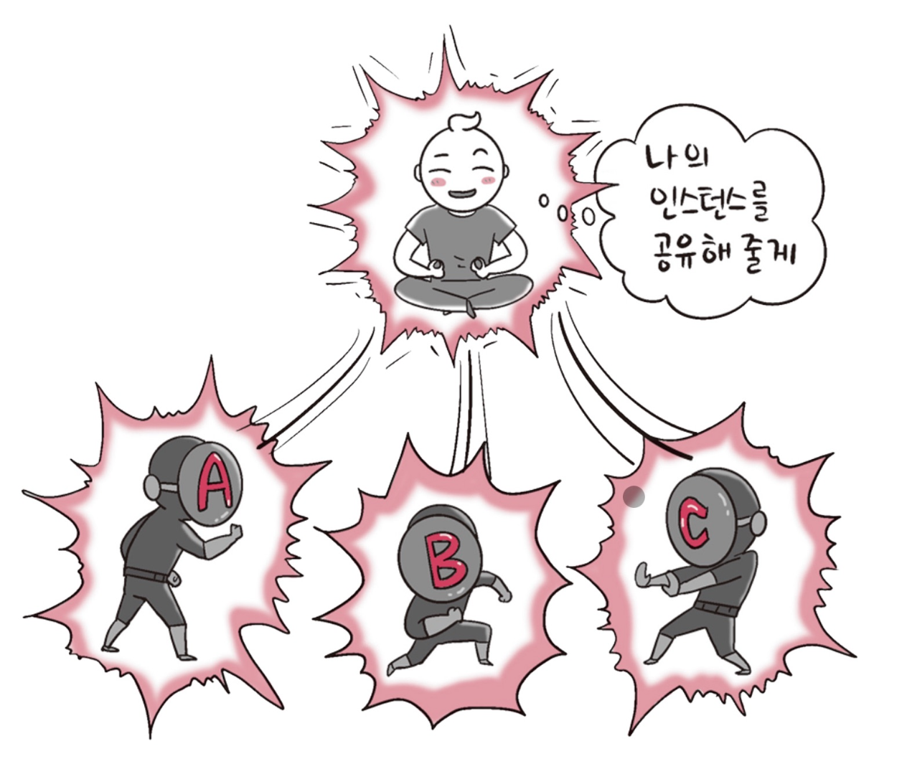

# ⚜️ 디자인 패턴 ⚜️

---

## 📚 싱글톤 패턴


### ☝ 싱글톤 패턴이란?

> **하나의 클래스**에 오직 **하나의 인스턴스**만 가지는 패턴이다. 하나의 클래스를 기반으로 여러 개의 개별적인 인스턴스를 만들 수 있지만, 그렇게 하지 않고 하나의 클래스를 기반으로 단 하나의 인스턴스를 만들어 이를 기반으로 로직을 만드는 데 쓰이며, 보통 DB 연결 모듈에 많이 쓰인다.



- 장점 → 인스턴스 생성 비용 감소
- 단점 → 의존성이 높아짐

---


### ☝ 자바스크립트의 싱글톤 패턴


자바스크립트에서는 리터럴 `{}` 또는 `new Object`로 객체를 생성하게 되면 다른 어떤 객체와도 다르기 때문에 이 자체만으로 싱글톤 패턴을 구현할 수 있다.

```jsx
const obj = { 
	a: 27
}
const obj2 = { 
	a: 27
}
console.log(obj === obj2)
// false
```

위 코드에서 `obj`와 `obj2`는 다른 인스턴스이다. 이 또한 `new Object` 클래스에서 나온 단 하나의 인스턴스이기 때문에 싱글톤 패턴이라 볼 수 있지만, 실제 싱글톤 패턴은 다음과 같이 구성된다.

```jsx
class Singleton {
	constructor () {
		if (!Singleton.instance) {
			Singleton. instance = this 
		}
		return Singleton. instance 
	}
	get Instance () { 
		return this
	} 
}
const a = new Singleton() 
const b = new Singleton()
console.log(a === b) // true
```

위 코드는 `Singleton.instance`라는 하나의 인스턴스를 가지는 `Singleton` 클래스를 구현한 모습이다.

---

### ☝ DB 연결 모듈


```jsx
const URL = 'mongodb://localhost: 27017/kundolapp'
const createConnection = url => ({"url" : url})
class DB { 
	constructor(url) {
		if (!DB.instance) {
			DB.instance = createConnection(url)
		}
		return DB.instance }
		connect(){
			return this.instance
		}
}
const a = new DB(URL)
const b = new DB(URL) 
console.log(a === b) // true
```

위처럼 `DB.instance`라는 하나의 인스턴스를 기반으로 a, b를 생성하여 DB 연결에 관한 인스턴스 생성 비용을 아낄 수 있다.

---


### ☝ 자바에서의 싱글톤 패턴


자바에서는 다음과 같이 중첩 클래스를 이용해서 만드는 방법이 가장 대중적이다.

```java
class Singleton {
    private static class singleInstanceHolder {
        private static final Singleton INSTANCE = new Singleton();
    }

    public static Singleton getInstance() {
        return singleInstanceHolder.INSTANCE;
    }
}

public class HelloWorld {
    public static void main(String[] args) {
        Singleton a = Singleton.getInstance();
        Singleton b = Singleton.getInstance();
        System.out.println(a.hashCode());
        System.out.println(b.hashCode());
        if (a == b) {
            System.out.println(true);
        }
    }
}
/*
705927765 
705927765
true
*/
```

---


### ☝ mongoose의 싱글톤 패턴


실제로 `Node.js`에서 `MongoDB`를 연결할 때 쓰는 `mongoose` 모듈에서 볼 수 있다.


`mongoose`의 DB를 연결할 때 쓰는 `connect()`라는 함수는 싱글톤 인스턴스를 반환합니다. 다음은 `connect()` 함수를 구현할 때 쓰인 실제 코드이다.

```jsx
Mongoose.prototype.connect = function(uri, options, callback) { 
	const _mongoose = this instanceof Mongoose ? this : mongoose;
	const conn = _mongoose.connection;
	return _mongoose._promiseOrCallback(callback, cb => { 
		conn. openUri (uri, options, err => {
			if (err != null) {
				return cb(err); 
			}
			return cb(null, _mongoose); 
		});
	});
};
```

---

### ☝ MySQL의 싱글톤 패턴


`Node.js`에서 `MySQL` DB를 연결할 때도 싱글톤 패턴이 쓰인다.


```jsx
const mysql = require('mysql');
const pool = mysql.createPool({
	connectionLimit: 10,
	host: 'example.org',
	user: 'root',
	password: 'secret',
	database: 'lukeDB'
});
pool.connect();

// 모듈 A
pool.query(query, function (error, results, fields) {
	if (error) throw error;
	console.log('The solution is: ', results[0].solution);
});

// 모듈 B
pool.query(query, function (error, results, fields) {
	if (error) throw error;
	console.log('The solution is: ', results[0].solution);
});
```

위 코드처럼 메인 모듈에서 DB 연결에 관한 인스턴스를 정의하고 다른 모듈인 A 또는 B에서 해당 인스턴스를 기반으로 쿼리를 보내는 형식으로 쓰인다.

---


### ☝ 싱글톤 패턴의 단점


싱글톤 패턴은 `TDD`(Test Driven Development)를 할 때 걸림돌이 된다.

`TDD`를 할 때 단위 테스트를 주로 하는데, 단위 테스트는 테스트가 서로 독립적이어야 하며 테스트를 어떤 순서로든 실행할 수 있어야 한다.

하지만 싱글톤 패턴은 미리 생성된 하나의 인스턴스를 기반으로 구현하는 패턴이므로 각 테스트마다 **‘독립적인’** 인스턴스를 만들기가 힘들다.

---


### ☝ DI (Dependency Injection)


싱글톤 패턴은 사용하기가 쉽고 굉장히 실용적이지만 모듈 간의 **결합을 강하게** 만든다는 단점이 있다.

이때 의존성 주입(DI, Dependency Injection)을 통해 모듈 간의 결합을 조금 더 느슨하게 만들어 해결할 수 있다.


#### 🗒️ **참고**


- 의존성이란 종속성이라고도 하며 A가 B에 의존성이 있다는 것은 B의 변경 사항에 대해 A 또한 변해야 된다는 것을 의미한다.


위 그림처럼 메인 모듈이 **직접** 다른 하위 모듈에 대한 의존성을 주는게 아닌, 중간에 의존성 주입자가 이 부분을 가로채 메인 모듈이 **간접적**으로 의존성을 주입하는 방식이다.

이를 통해 메인 모듈(상위 모듈)은 하위 모듈에 대한 의존성이 떨어진다.
(디커플링 된다)

- 장점

  → 모듈들을 쉽게 교체할 수 있는구조가 되어 테스팅하기 쉽고 마이그레이션하기 수월하다.
  → 의존성 방향이 일관되고, 애플리케이션을 쉽게 추론할 수 있으며, 모듈 간의 관계들이 조금 더 명확해진다.

- 단점

  → 모듈이 분리되어 클래스 수가 늘어나서 복잡성이 증가될 수 있고, 약간의 런타임 패널티가 생기기도 한다.

- **의존성 주입 원칙**

  → 상위 모듈은 하위 모듈에서 어떠한 것도 가져오지 않아야 한다.

  → 두 모듈 전부 추상화에 의존해야 한다.

  → 추상화 시에 세부사항에 의존하지 말아햐 한다.