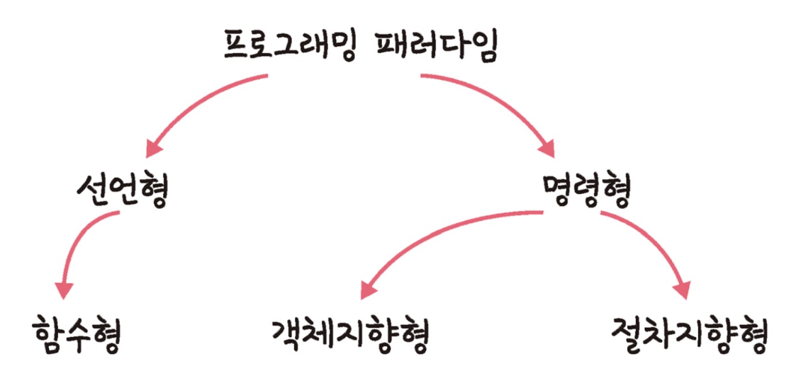

# ⚜️ 프로그래밍 패러다임  ⚜️

> 소프트웨어 개발에서 특정 프로그래밍 스타일 또는 철학을 정의한다. 주요 프로그래밍 패러다임에는 명령형, 선언형, 함수형, **객체지향 프로그래밍**이 있다.
>

**프로그래밍 패러다임의 분류**

### ☝ **선언형과 함수형 프로그래밍**

> 명령형은 **어떻게(`How`)**에, 선언형은 **무엇을(`What`)**에 집중
>
- **명령형(Imperative)**

  명령형 프로그래밍이란 프로그램의 상태와 상태를 변경시키는 구문의 관점에서 연산을 설명하는 프로그래밍 패러다임의 일종이다. 쉽게 설명하자면, 컴퓨터가 수행할 명령들을 순서대로 써 놓은 것이라고 볼 수 있다.

- **선언형(Declarative)**

  선언형 프로그래밍은 보통 두 가지 뜻으로 통용된다.   
    
    첫 번째는 프로그램이 무엇을 해야 할지를 나타내는 경우를 선언형이라고 한다. 예를 들어 컴퓨터 화면에 웹 페이지를 나타낼 때 "어떤 방법"으로 페이지를 나타내야 하는지 보다 제목, 본문, 그림 등과 같이 "무엇"을 화면에 나타내야 할지를 고민하는 것이 선언형 프로그래밍이다.   
    
    두 번째는 프로그램이 함수형, 논리형, 제한형 프로그래밍 언어 등으로 작성된 경우에 선언형이라고 한다.

  SQL, HTML 등이 선언형 프로그래밍 언어의 일종이라고 할 수 있다. ~~(HTML이 프로그래밍 언어가 맞나? 애초에? 음..)~~

**선언형**이란 **명령형 코드에서 ‘어떻게’를 감추고 ‘무엇을’만 노출하는 방식의 추상화**(일종의 리팩토링)라고 할 수 있겠다.

🗒️ **순수 함수**

- 함수형 프로그래밍에서는 어떤 외부 상태에 의존하지도 않고 변경시키지도 않는, 즉 부수 효과(Side Effect)가 없는 함수를 **순수함수(Pure function)**이라고 한다. 즉, 동일한 입력이 주어지면 항상 동일한 출력을 반환하는 함수를 뜻한다.

🗒️ **고차 함수**

- 고차 함수란, 함수를 파라미터로 **전달**받거나 **연산의 결과로 반환**해주는 메서드를 일컫는다. 요즘 자주 거론되는 함수형 프로그래밍의 핵심이기도 하며, 자바스크립트를 함수형 프로그래밍에 알맞은 언어로 만들어주는 특성이기도 하다.

🗒️ **일급 객체**

- 사용할 때 다른 요소들과 아무런 차별이 없는 객체를 의미하며 다음 3가지 조건을 충족하는 객체를 일컫는다.
    - **모든 일급 객체는 변수나 데이터에 담을 수 있어야 한다.**
    - **모든 일급 객체는 함수의 파라미터로 전달할 수 있어야 한다.**
    - **모든 일급 객체는 함수의 리턴값으로 사용할 수 있어야 한다.**

---

### ☝ **객체지향 프로그래밍**

> 데이터를 중심으로 프로그램을 구조화하고, 데이터와 그 데이터를 처리하는 연산들을 객체로 캡슐화하는 방법이다. 객체 지향 프로그래밍의 핵심은 프로그램을 상호작용하는 **객체들의 모임**으로 보는 것이다.
각 객체는 데이터(속성)와 그 데이터를 조작할 수 있는메소드를 포함하고 있다.
>

객체 지향 프로그래밍의 주요 개념은 다음과 같다.

- **클래스(Class)와 객체(Object)**
    - **클래스**는 객체를 생성하기 위한 템플릿이며 속성(데이터 필드)과 메소드(함수)로 구성
    - **객체**는 클래스의 인스턴스로, 클래스에 정의된 속성과 메소드를 실제 데이터와 함께 가지게 됨
- **상속(Inheritance)**
    - 한 클래스가 다른 클래스의 속성과 메소드를 상속받아 사용할 수 있게 함
    - 코드의 재사용성을 높이고, 중복을 줄이며, 유지 보수를 쉽게 할 수 있음
- **캡슐화(Encapsulation)**
    - 객체의 데이터를 외부에서 직접 접근하는 것을 제한하고, 객체의 메소드를 통해서만 데이터에 접근
    - 데이터의 무결성과 보안을 보장
- **다형성(Polymorphism)**
    - 같은 이름의 메소드가 다른 클래스에서 다른 기능을 할 수 있음
    - 메소드 오버로딩(동일 메소드 이름으로 다른 매개 변수)과 메소드 오버라이딩(상속받은 메소드를 재정의)을 통해 구현
        - **오버로딩** → 정적 다형성
        - **오버라이딩** → 동적 다형성
- **추상화(Abstraction)**
    - 복잡한 실세계 문제를 단순화하는 프로세스
    - 필요한 정보만을 사용하여 인터페이스를 간단하게 만들고, 복잡한 내부 구현은 숨김

---

### ☝ **SOLID 설계원칙**

> SOLID 원칙은 객체 지향 프로그래밍과 디자인에서 유지 보수가 용이하고 이해하기 쉽고, 확장 가능한 소프트웨어를 설계하는 데 도움을 주는 다섯 가지 **기본 원칙**이다. 이 원칙들은 로버트 C. 마틴(Robert C. Martin)에 의해 소개되었고, 다른 객체 지향 접근법과 함께 개발자들 사이에서 널리 채택되고 있다.
>

## SRP (Single Responsibility Principle)

> **단일 책임 원칙**
>
- **한 클래스는 하나의 책임만** 가져야 한다. (책임은 하나의 **기능 담당**으로 보면 됨)
- 책임이란 한 클래스가 변경되어야 하는 이유를 의미한다.
- 이 원칙을 따르면 클래스를 변경할 이유가 하나뿐이므로 코드의 복잡성이 줄어들고, 유지 보수가 용이해진다.

## OCP (Open Closed Principle)

> **개방 폐쇄 원칙**
>
- 소프트웨어 개체(클래스, 모듈, 함수 등)는 **확장에는 열려** 있어야 하지만 **변경에는 닫혀** 있어야 한다.
- 기존의 코드를 변경하지 않고도 해당 모듈의 기능을 확장할 수 있어야 한다.
- 이는 **상속**과 같은 메커니즘을 사용하여 구현할 수 있습니다. (**추상화 사용**을 통한 관계 구축 권장을 의미)

## LSP (Listov Substitution Principle)

> **리스코프 치환 원칙**
>
- 프로그램의 객체는 프로그램의 정확성을 해치지 않으면서 **하위 타입의 인스턴스**로 바꿀 수 있어야 한다.
- 이 원칙은 상속을 사용할 때, 하위 클래스가 그 상위 클래스의 행동을 정확하게 모방해야 하며, 상위 클래스의 인스턴스 대신 하위 클래스의 인스턴스를 사용해도 프로그램의 기능에 영향을 미치지 않아야 한다는 것을 의미한다.

## ISP (Interface Segregation Principle)

> **인터페이스 분리 원칙**
>
- 한 클래스는 자신이 사용하지 않는 인터페이스는 구현하지 말아야 한다.
- 즉, 하나의 일반적인 인터페이스보다는 **여러 개의 구체적인 인터페이스**가 낫다는 원칙이다.
- 이를 통해 클라이언트는 자신이 이용하지 않는 메소드에 의존하지 않게 되므로, 인터페이스가 더 작고 관련성이 높게 유지된다.

## DIP (Dependency Inversion Principle)

> **의존 역전 원칙**
>
- 고수준 모듈은 저수준 모듈에 의존해서는 안 되며, 두 모듈 모두 **추상화에 의존**해야 합니다.
- 추상화는 구체적인 세부사항에 의존해서는 안 되고, **구체적인 세부사항은 추상화에 의존**해야 합니다.
- 이 원칙은 설계를 더 유연하게 만들어 주며, 고수준의 비즈니스 로직과 저수준의 구성 요소 간의 결합도를 낮추는 데 도움을 줍니다.

---

### ☝ **절차형 프로그래밍**

> 절차형 프로그래밍(Procedural Programming)은 컴퓨터 프로그래밍의 한 방식으로, 코드를 일련의 절차나 루틴(함수)으로 구성하는 것을 특징으로 한다. 이 방식은 프로그램의 상태를 변경하기 위해 **순차적인 절차를 실행**하는 데 중점을 둔다. 절차형 프로그래밍은 특히 C언어에서 잘 나타나며, Fortran, Pascal, BASIC 등 다른 많은 초기 프로그래밍 언어들도 이 패러다임을 따른다.
>

---

### ☝ **Q&A**

- **옵저버 패턴을 어떻게 구현하나요?**

  여러 가지 방법이 있지만 프록시 객체를 써서 하곤 합니다. 프록시 객체를 통해 객체의 속성이나 메서드 변화 등을 감지하고 이를 미리 설정해 놓은 옵저버들에게 전달하는 방법으로 구현합니다.

- **프록시 서버를 설명하고 사용 사례에 대해 설명해보세요.**

  프록시 서버는 클라이언트와 인터넷 사이에서 중개자 역할을 하는 서버입니다. 이 서버는 클라이언트의 요청을 받아 인터넷에 대신 요청을 보내고, 그 결과를 다시 클라이언트에게 전달합니다. 프록시 서버를 사용함으로써 보안 강화, 성능 향상, 데이터 접근 제어 등 여러 가지 이점을 얻을 수 있습니다. 주로 서버 앞단에 둬서 캐싱, 로깅, 데이터 분석을 서버보다 먼저 하는 서버로 쓰입니다. DDOS 공격을 차단하거나 CDN을 프록시 서버로 캐싱할 수 있으며, 버퍼 오버플로우도 해결할 수 있습니다.

- **MVC 패턴을 설명하고 MVVM 패턴과의 차이는 무엇인지 설명해보세요.**

  MVC (Model-View-Controller) 패턴은 소프트웨어 개발에서 사용자 인터페이스를 구성하는 구성 요소를 세 가지로 분리하여 관리하는 아키텍처 패턴입니다.

  MVVM 패턴은 데이터 바인딩을 중심으로 작동하여, 뷰와 뷰모델 사이의 자동 동기화를 가능하게 합니다. 이는 뷰모델이 뷰의 상태를 직접 제어하지 않고, 뷰가 필요한 데이터와 명령을 뷰모델에 선언적으로 바인딩함으로써 MVC에서 발생할 수 있는 수동적 업데이트 필요성을 줄여줍니다. 따라서 MVVM은 개발자가 더 세밀하고 직관적인 방식으로 사용자 인터페이스를 관리할 수 있도록 해줍니다.