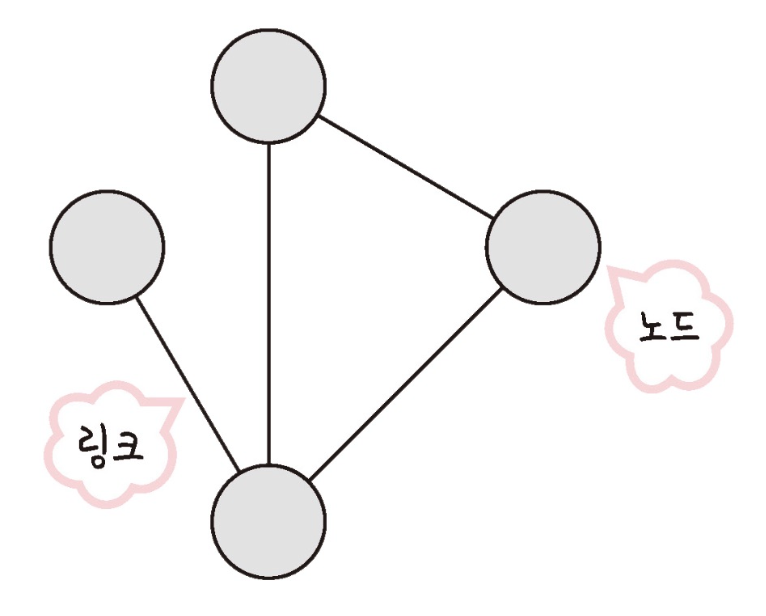

# ⚜️ 네트워크 ⚜️

---
## 📚 네트워크의 기초

> 네트워크는 서로 연결된 두 개 이상의 장치(컴퓨터, 서버, 스마트폰 등)가 데이터를 교환할 수 있도록 구성된 시스템을 말한다. 이러한 장치들은 케이블, 전화선, 무선 신호 등 다양한 통신 매체를 통해 서로 연결될 수 있다.
>



**노드와 링크**

- **노드** → 서버, 라우터, 스위치
- **링크** → 유선, 무선

### ☝ 처리량과 지연 시간


### 처리량 (Throughput)

> 일정 시간 동안 시스템이 처리할 수 있는 **데이터의 양**을 나타내는 용어이다. 이는 일반적으로 초당 비트 수(bits per second), 패킷 수(packets per second), 작업 수(operations per second), 또는 트랜잭션 수(transactions per second)와 같이 측정된다. 처리량은 시스템의 성능을 평가하는 중요한 지표 중 하나로, 네트워크, 서버, 프로세서, 데이터베이스 등 다양한 컴퓨팅 리소스와 시스템의 성능을 측정할 때 사용된다.
>


**처리량**

### 🗒️ 대역폭

- 네트워크에서 특정 시간 동안 전송할 수 있는 **데이터의 최대 양**을 나타내는 용어이다. 일반적으로 비트 단위로 초당 전송량(bps, bits per second)으로 측정되며, 네트워크의 통신 용량을 말한다.

### 지연 시간 (Latency)

> 네트워크에서 데이터가 한 지점에서 다른 지점까지 **전달되는 데 걸리는 시간**을 의미한다. 이 시간은 데이터가 송신자로부터 수신자까지 이동하는 데 소요되는 전체 시간을 포함하며, 네트워크의 효율성을 나타내는 중요한 지표 중 하나이다.
>


지연 시간

---


### ☝ **네트워크 토폴로지와 병목 현상**


> 토폴로지는 네트워크 내의 장치들이 서로 어떻게 물리적 또는 논리적으로 연결되어 있는지를 나타내는 구성을 의미한다. 토폴로지는 네트워크의 성능, 확장성, 그리고 결함 내성(fault tolerance)에 중대한 영향을 미친다.
>

### 버스 토폴로지


**버스 토폴로지**

- 버스 토폴로지에서 모든 컴퓨터와 장치들은 단일 통신선(버스)에 연결된다.
- 이 토폴로지는 설치가 간단하고 비용이 저렴하지만, 버스에 문제가 발생하면 전체 네트워크에 영향을 줄 수 있다.

### 🗒️ **스푸핑 (Spoofing)**

- 사이버 보안의 맥락에서 사용자, 장치, 네트워크를 속여서 **진짜로 보이게 하는 행위**를 말한다. 이를 통해 공격자는 피해자의 신원을 도용하거나 네트워크에 무단으로 접근하거나 데이터를 훔칠 수 있다.


- `**IP 스푸핑`, `이메일 스푸핑`, `ARP 스푸핑`, `DNS 스푸핑`, `Caller 스푸핑`** 등이 있다.

### 스타 토폴로지


**스타 토폴로지**

- 스타 토폴로지에서는 중앙에 위치한 하나의 중앙 컴퓨터나 스위치가 모든 장치를 연결한다.
- 중앙 장치에 대한 의존도가 높지만, 개별 연결에 문제가 생겨도 네트워크 전체에는 영향을 미치지 않는다. 확장성도 뛰어나다.

### 트리 토폴로지


**트리 토폴로지**

- 트리 토폴로지는 스타와 버스 토폴로지의 특징을 결합한 형태로, 계층적으로 연결된 스타 네트워크의 집합이다.
- 중앙 노드를 통한 계층적 관리가 가능하며, 확장성이 좋지만 중앙 노드에 문제가 생기면 해당 부분의 네트워크가 영향을 받는다.

### 링 토폴로지


**링 토폴로지**

- 링 토폴로지에서는 각 컴퓨터가 두 개의 인접한 장치와 직접 연결되어, 닫힌 루프(링)를 형성한다.
- 데이터는 일방통행으로 순환하며, 링 내의 한 장치에 문제가 생기면 전체 네트워크가 영향을 받을 수 있다.

### 메시 토폴로지


**메시 토폴로지**

- 메시 토폴로지에서는 장치들이 서로 완전히 또는 부분적으로 연결된다.
- 완전 메시 토폴로지에서는 모든 노드가 서로 연결되어 있어 높은 결함 내성을 제공하지만, 설치 및 유지관리 비용이 매우 높다.
- 부분 메시 토폴로지는 일부 중요 노드만 전체적으로 연결되어 비용과 복잡성을 줄인다.

### 병목 현상

> 특정 네트워크 구간이나 장치가 과부하 상태에 이르러 전체 **네트워크 성능이 저하**되는 현상을 말한다. 이러한 병목 현상은 **네트워크 대역폭, 토폴로지, 서버 CPU, 메모리 사용량, 비효율적인 설계**의 문제로 인해 발생할 수 있다.
>

---

### ☝ **네트워크 분류**


네트워크는 크기와 기능에 따라 여러 가지로 분류될 수 있으며, 각각의 유형은 특정한 목적과 요구 사항을 충족시키기 위해 설계된다. 네트워크의 범위와 사용되는 기술에 따라 분류되는 몇 가지 기본적인 유형이 있다.

### 개인 영역 네트워크 (PAN)

> 개인 사용자의 작은 영역(예: 집이나 작은 사무실) 내에서 사용되는 네트워크이다. 이는 주로 개인 장비 간의 데이터 전송을 위해 설정되며, 블루투스 및 Wi-Fi 같은 무선 기술을 사용할 수 있다.
>

### 로컬 영역 네트워크 (LAN)

> 상대적으로 **좁은 지역**(예: 학교, 사무실 건물, 가정)을 커버하는 네트워크이다. 이는 고속의 데이터 전송을 제공하며, 여러 장비(컴퓨터, 프린터 등)를 연결하여 리소스 공유를 가능하게 한다.
>

### 캠퍼스 영역 네트워크 (CAN)

> 교육 기관의 캠퍼스나 기업의 복합 건물과 같이 LAN보다 조금 더 넓은 지역에 걸쳐 있는 네트워크이다. CAN은 일반적으로 여러 건물의 LAN을 연결하는 데 사용된다.
>

### 메트로폴리탄 영역 네트워크 (MAN)

> **도시 규모**의 네트워크로, 하나의 큰 도시나 여러 도시를 포함할 수 있다. 이는 고속 데이터 전송을 지원하며, 여러 LAN과 WAN을 연결하는 데 사용된다.
>

### 광역 네트워크 (WAN)

> **국가나 대륙**을 넘나드는 매우 큰 영역을 커버한다. 인터넷이 가장 대표적인 예로, WAN은 지리적으로 분산된 영역에 있는 여러 LAN과 다른 네트워크 유형을 연결한다.
>

### 스토리지 영역 네트워크 (SAN)

> 서버와 네트워크 스토리지 장치를 연결하여 데이터 스토리지를 중앙화하는 데 사용되는 전용 네트워크이다. SAN은 데이터 액세스를 개선하고, 백업과 복구 작업을 용이하게 한다.
>

---

### ☝ **네트워크 성능 분석 명령어**


> 네트워크 성능을 분석하고 문제를 진단하기 위해 사용되는 여러 명령어가 있다. 이러한 명령어는 네트워크의 연결 상태, 지연 시간, 패킷 손실 등 다양한 성능 지표를 측정하는 데 도움이 된다.
>

### ping

> 네트워크 진단 도구로 널리 사용되며, 특정 호스트(컴퓨터나 기타 네트워크 장치)가 **네트워크 상에서 접근 가능한지**를 테스트하기 위해 설계된 명령줄 프로그램이다. 이 도구는 Internet Control Message Protocol (ICMP) 에코 요청을 목적지 호스트에 보내고, 에코 응답(또는 에코 리플라이)을 받음으로써 네트워크 연결의 상태를 확인한다. 사용자는 **`ping`** 명령어 뒤에 IP 주소나 도메인 이름을 입력하여 해당 서버나 장치와의 통신을 시도하게 된다.
>

```bash
ping [IP 주소 또는 도메인 주소]
```

### netStat

> 운영체제의 네트워크 연결, 라우팅 테이블, 인터페이스 통계, 마스커레이딩 연결, 멀티캐스트 멤버십 등 **다양한 네트워크 관련 정보를 보여주는** 명령줄 도구이다. 이 도구는 네트워크 문제를 진단하고, 네트워크 성능을 모니터링하는 데 매우 유용하다.
>

```bash
netstat -a // 모든 연결과 리스닝 포트 보기
netstat -t // TCP 연결만 보기
netstat -u // UDP 연결만 보기
netstat -r // 라우팅 테이블 보기
netstat -s // 연결된 소켓의 통계 보기
```

### nslookup

> 인터넷 DNS에 대한 쿼리를 실행하여 **도메인 이름을 IP 주소로 변환**하거나 **그 반대의 작업을 수행**하는 네트워크 관리 명령 줄 도구이다. 이 도구는 네트워크 관리자와 IT 전문가가 DNS 서버가 올바르게 작동하고 있는지 확인하고, DNS 레코드 문제를 진단하는 데 주로 사용된다.
>

### traceroute(tracert)

> 데이터 패킷이 소스(출발점)에서 목적지까지 이동할 때 거치는 라우터(노드)들의 경로를 추적하고 각 노드에서 발생하는 **지연 시간을 측정**하는 기능을 제공한다. 이 도구는 네트워크의 트래픽 라우팅 패턴과 각 네트워크 홉에서 발생하는 지연을 이해하는 데 유용하며, 네트워크의 성능 문제나 장애 지점을 진단하는 데 사용된다.
>

```bash
traceroute [옵션] 목적지
```

---

### ☝ **네트워크 프로토콜 표준화**


> 네트워크 장치, 시스템 및 소프트웨어가 서로 원활하게 통신할 수 있도록 하기 위해 필수적인 과정이다. 이러한 표준화는 데이터 교환 방식, 통신 규약 및 네트워크 상호 운용성에 대한 명확한 지침을 제공하여, 다양한 제조사의 장비나 다른 네트워크 설계를 사용하는 시스템 간에도 데이터가 효과적으로 전송될 수 있게 한다.
>

표준화 단체에는 다음과 같은 단체들이 있다.

- **ITU (국제 전기 통신 연합)** → 통신 기술에 관한 국제 표준을 개발하는 유엔 기구
- **IETF (인터넷 공학 태스크 포스)** → 인터넷 아키텍처 및 운영에 관련된 기술 표준을 개발함
- **ISO (국제 표준화 기구)** → 네트워크 프로토콜뿐만 아니라 다양한 산업 분야에서 국제 표준을 설정한다. ISO/IEC 11801, ISO/IEC 27001 등 다양한 네트워크 및 정보 보안 표준을 제공
- **IEEE (전기 전자 기술자 협회)** → 특히 로컬 및 메트로폴리탄 영역 네트워크 표준, 예를 들어 802.11(Wi-Fi)과 802.3(Ethernet) 표준을 개발한다.

---