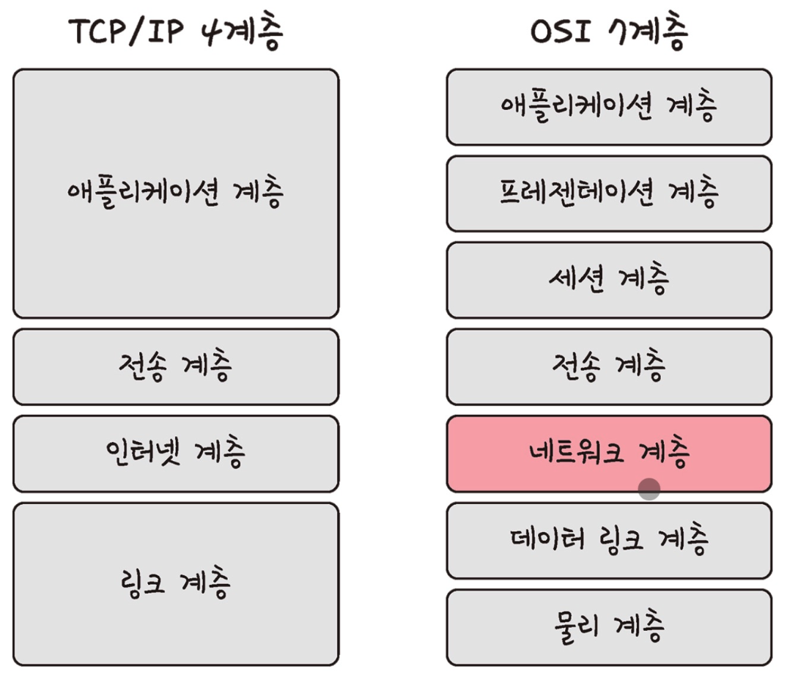

# ⚜️ 네트워크 ⚜️

---
## 📚 네트워크의 기초

> 네트워크는 서로 연결된 두 개 이상의 장치(컴퓨터, 서버, 스마트폰 등)가 데이터를 교환할 수 있도록 구성된 시스템을 말한다. 이러한 장치들은 케이블, 전화선, 무선 신호 등 다양한 통신 매체를 통해 서로 연결될 수 있다.
>


**노드와 링크**

- **노드** → 서버, 라우터, 스위치
- **링크** → 유선, 무선

### ☝ 처리량과 지연 시간


### 처리량 (Throughput)

> 일정 시간 동안 시스템이 처리할 수 있는 **데이터의 양**을 나타내는 용어이다. 이는 일반적으로 초당 비트 수(bits per second), 패킷 수(packets per second), 작업 수(operations per second), 또는 트랜잭션 수(transactions per second)와 같이 측정된다. 처리량은 시스템의 성능을 평가하는 중요한 지표 중 하나로, 네트워크, 서버, 프로세서, 데이터베이스 등 다양한 컴퓨팅 리소스와 시스템의 성능을 측정할 때 사용된다.
>


**처리량**

### 🗒️ 대역폭

- 네트워크에서 특정 시간 동안 전송할 수 있는 **데이터의 최대 양**을 나타내는 용어이다. 일반적으로 비트 단위로 초당 전송량(bps, bits per second)으로 측정되며, 네트워크의 통신 용량을 말한다.

### 지연 시간 (Latency)

> 네트워크에서 데이터가 한 지점에서 다른 지점까지 **전달되는 데 걸리는 시간**을 의미한다. 이 시간은 데이터가 송신자로부터 수신자까지 이동하는 데 소요되는 전체 시간을 포함하며, 네트워크의 효율성을 나타내는 중요한 지표 중 하나이다.
>


지연 시간

---


### ☝ **네트워크 토폴로지와 병목 현상**


> 토폴로지는 네트워크 내의 장치들이 서로 어떻게 물리적 또는 논리적으로 연결되어 있는지를 나타내는 구성을 의미한다. 토폴로지는 네트워크의 성능, 확장성, 그리고 결함 내성(fault tolerance)에 중대한 영향을 미친다.
>

### 버스 토폴로지


**버스 토폴로지**

- 버스 토폴로지에서 모든 컴퓨터와 장치들은 단일 통신선(버스)에 연결된다.
- 이 토폴로지는 설치가 간단하고 비용이 저렴하지만, 버스에 문제가 발생하면 전체 네트워크에 영향을 줄 수 있다.

### 🗒️ **스푸핑 (Spoofing)**

- 사이버 보안의 맥락에서 사용자, 장치, 네트워크를 속여서 **진짜로 보이게 하는 행위**를 말한다. 이를 통해 공격자는 피해자의 신원을 도용하거나 네트워크에 무단으로 접근하거나 데이터를 훔칠 수 있다.


- `**IP 스푸핑`, `이메일 스푸핑`, `ARP 스푸핑`, `DNS 스푸핑`, `Caller 스푸핑`** 등이 있다.

### 스타 토폴로지


**스타 토폴로지**

- 스타 토폴로지에서는 중앙에 위치한 하나의 중앙 컴퓨터나 스위치가 모든 장치를 연결한다.
- 중앙 장치에 대한 의존도가 높지만, 개별 연결에 문제가 생겨도 네트워크 전체에는 영향을 미치지 않는다. 확장성도 뛰어나다.

### 트리 토폴로지


**트리 토폴로지**

- 트리 토폴로지는 스타와 버스 토폴로지의 특징을 결합한 형태로, 계층적으로 연결된 스타 네트워크의 집합이다.
- 중앙 노드를 통한 계층적 관리가 가능하며, 확장성이 좋지만 중앙 노드에 문제가 생기면 해당 부분의 네트워크가 영향을 받는다.

### 링 토폴로지


**링 토폴로지**

- 링 토폴로지에서는 각 컴퓨터가 두 개의 인접한 장치와 직접 연결되어, 닫힌 루프(링)를 형성한다.
- 데이터는 일방통행으로 순환하며, 링 내의 한 장치에 문제가 생기면 전체 네트워크가 영향을 받을 수 있다.

### 메시 토폴로지


**메시 토폴로지**

- 메시 토폴로지에서는 장치들이 서로 완전히 또는 부분적으로 연결된다.
- 완전 메시 토폴로지에서는 모든 노드가 서로 연결되어 있어 높은 결함 내성을 제공하지만, 설치 및 유지관리 비용이 매우 높다.
- 부분 메시 토폴로지는 일부 중요 노드만 전체적으로 연결되어 비용과 복잡성을 줄인다.

### 병목 현상

> 특정 네트워크 구간이나 장치가 과부하 상태에 이르러 전체 **네트워크 성능이 저하**되는 현상을 말한다. 이러한 병목 현상은 **네트워크 대역폭, 토폴로지, 서버 CPU, 메모리 사용량, 비효율적인 설계**의 문제로 인해 발생할 수 있다.
>

---

### ☝ **네트워크 분류**


네트워크는 크기와 기능에 따라 여러 가지로 분류될 수 있으며, 각각의 유형은 특정한 목적과 요구 사항을 충족시키기 위해 설계된다. 네트워크의 범위와 사용되는 기술에 따라 분류되는 몇 가지 기본적인 유형이 있다.

### 개인 영역 네트워크 (PAN)

> 개인 사용자의 작은 영역(예: 집이나 작은 사무실) 내에서 사용되는 네트워크이다. 이는 주로 개인 장비 간의 데이터 전송을 위해 설정되며, 블루투스 및 Wi-Fi 같은 무선 기술을 사용할 수 있다.
>

### 로컬 영역 네트워크 (LAN)

> 상대적으로 **좁은 지역**(예: 학교, 사무실 건물, 가정)을 커버하는 네트워크이다. 이는 고속의 데이터 전송을 제공하며, 여러 장비(컴퓨터, 프린터 등)를 연결하여 리소스 공유를 가능하게 한다.
>

### 캠퍼스 영역 네트워크 (CAN)

> 교육 기관의 캠퍼스나 기업의 복합 건물과 같이 LAN보다 조금 더 넓은 지역에 걸쳐 있는 네트워크이다. CAN은 일반적으로 여러 건물의 LAN을 연결하는 데 사용된다.
>

### 메트로폴리탄 영역 네트워크 (MAN)

> **도시 규모**의 네트워크로, 하나의 큰 도시나 여러 도시를 포함할 수 있다. 이는 고속 데이터 전송을 지원하며, 여러 LAN과 WAN을 연결하는 데 사용된다.
>

### 광역 네트워크 (WAN)

> **국가나 대륙**을 넘나드는 매우 큰 영역을 커버한다. 인터넷이 가장 대표적인 예로, WAN은 지리적으로 분산된 영역에 있는 여러 LAN과 다른 네트워크 유형을 연결한다.
>

### 스토리지 영역 네트워크 (SAN)

> 서버와 네트워크 스토리지 장치를 연결하여 데이터 스토리지를 중앙화하는 데 사용되는 전용 네트워크이다. SAN은 데이터 액세스를 개선하고, 백업과 복구 작업을 용이하게 한다.
>

---

### ☝ **네트워크 성능 분석 명령어**


> 네트워크 성능을 분석하고 문제를 진단하기 위해 사용되는 여러 명령어가 있다. 이러한 명령어는 네트워크의 연결 상태, 지연 시간, 패킷 손실 등 다양한 성능 지표를 측정하는 데 도움이 된다.
>

### ping

> 네트워크 진단 도구로 널리 사용되며, 특정 호스트(컴퓨터나 기타 네트워크 장치)가 **네트워크 상에서 접근 가능한지**를 테스트하기 위해 설계된 명령줄 프로그램이다. 이 도구는 Internet Control Message Protocol (ICMP) 에코 요청을 목적지 호스트에 보내고, 에코 응답(또는 에코 리플라이)을 받음으로써 네트워크 연결의 상태를 확인한다. 사용자는 **`ping`** 명령어 뒤에 IP 주소나 도메인 이름을 입력하여 해당 서버나 장치와의 통신을 시도하게 된다.
>

```bash
ping [IP 주소 또는 도메인 주소]
```

### netStat

> 운영체제의 네트워크 연결, 라우팅 테이블, 인터페이스 통계, 마스커레이딩 연결, 멀티캐스트 멤버십 등 **다양한 네트워크 관련 정보를 보여주는** 명령줄 도구이다. 이 도구는 네트워크 문제를 진단하고, 네트워크 성능을 모니터링하는 데 매우 유용하다.
>

```bash
netstat -a // 모든 연결과 리스닝 포트 보기
netstat -t // TCP 연결만 보기
netstat -u // UDP 연결만 보기
netstat -r // 라우팅 테이블 보기
netstat -s // 연결된 소켓의 통계 보기
```

### nslookup

> 인터넷 DNS에 대한 쿼리를 실행하여 **도메인 이름을 IP 주소로 변환**하거나 **그 반대의 작업을 수행**하는 네트워크 관리 명령 줄 도구이다. 이 도구는 네트워크 관리자와 IT 전문가가 DNS 서버가 올바르게 작동하고 있는지 확인하고, DNS 레코드 문제를 진단하는 데 주로 사용된다.
>

### traceroute(tracert)

> 데이터 패킷이 소스(출발점)에서 목적지까지 이동할 때 거치는 라우터(노드)들의 경로를 추적하고 각 노드에서 발생하는 **지연 시간을 측정**하는 기능을 제공한다. 이 도구는 네트워크의 트래픽 라우팅 패턴과 각 네트워크 홉에서 발생하는 지연을 이해하는 데 유용하며, 네트워크의 성능 문제나 장애 지점을 진단하는 데 사용된다.
>

```bash
traceroute [옵션] 목적지
```

---

### ☝ **네트워크 프로토콜 표준화**


> 네트워크 장치, 시스템 및 소프트웨어가 서로 원활하게 통신할 수 있도록 하기 위해 필수적인 과정이다. 이러한 표준화는 데이터 교환 방식, 통신 규약 및 네트워크 상호 운용성에 대한 명확한 지침을 제공하여, 다양한 제조사의 장비나 다른 네트워크 설계를 사용하는 시스템 간에도 데이터가 효과적으로 전송될 수 있게 한다.
>

표준화 단체에는 다음과 같은 단체들이 있다.

- **ITU (국제 전기 통신 연합)** → 통신 기술에 관한 국제 표준을 개발하는 유엔 기구
- **IETF (인터넷 공학 태스크 포스)** → 인터넷 아키텍처 및 운영에 관련된 기술 표준을 개발함
- **ISO (국제 표준화 기구)** → 네트워크 프로토콜뿐만 아니라 다양한 산업 분야에서 국제 표준을 설정한다. ISO/IEC 11801, ISO/IEC 27001 등 다양한 네트워크 및 정보 보안 표준을 제공
- **IEEE (전기 전자 기술자 협회)** → 특히 로컬 및 메트로폴리탄 영역 네트워크 표준, 예를 들어 802.11(Wi-Fi)과 802.3(Ethernet) 표준을 개발한다.

---

## 📚 TCP/IP 4계층 모델

> TCP/IP 모델은 인터넷의 통신 프로토콜을 이해하기 위한 기본적인 구조로, 여기서는 네트워크 통신 과정을 네 개의 계층으로 나누어 설명한다. 이 모델은 데이터가 사용자의 어플리케이션에서 네트워크를 거쳐 다른 시스템의 어플리케이션으로 전송되는 과정을 단순화하여 보여준다.

이 계층 모델은 네트워크에서 사용되는 통신 프로토콜의 집합으로 계층들은 프로토콜의 네트워킹 범위에 따라 네 개의 추상화 계층으로 구성된다.


### ☝ **계층 구조**




4계층 vs 7계층

### 응용 계층 (Application Layer)

> 사용자가 실제로 인터페이스할 수 있는 수준으로, 네트워크 서비스와 직접 상호 작용하는 어플리케이션들을 포함한다. 이 계층은 네트워크 소프트웨어와 사용자 간의 인터페이스 역할을 하며, 예를 들면 **HTTP(웹 서핑), SMTP(이메일 전송), FTP(파일 전송)** 등이 있다. 응용 계층은 사용자의 데이터를 받아 하위 계층으로 전달하고, 네트워크에서 전송된 데이터를 사용자에게 제공하는 기능을 담당한다.
>

### 전송 계층 (Transport Layer)

> 시스템 간의 데이터 전송을 관리한다. 이 계층의 주된 프로토콜은 **TCP(Transmission Control Protocol)와 UDP(User Datagram Protocol), QUIC(Quick UDP Internet Connections)** 등이 있다.
TCP는 연결 지향적이며 데이터 전송의 신뢰성과 순서를 보장한다. 데이터가 손상되거나 유실된 경우 재전송을 요청한다.
반면, UDP는 연결을 설정하지 않고 데이터를 보내는 비연결 지향적 프로토콜로, 빠르지만 신뢰성은 낮다.
>


### 🗒️ **가상회선 패킷 교환 방식**

- 데이터 통신에서 널리 사용되는 네트워크 기술로, 패킷을 전송하기 전에 송신지와 수신지 간에 **논리적인 연결(가상회선)을 설정**하는 방식이다.
- 이 가상회선은 데이터 전송 동안 고정된 경로를 유지하며, 연결이 설정된 후에는 모든 패킷이 동일한 경로를 따라 전송된다.
- 이 방식은 전화 네트워크의 회선 교환과 유사한 점이 있으나, 실제로 전용 물리적 회선을 사용하지는 않고 논리적인 연결을 통해 데이터를 전송한다.


가상회선 패킷 교환 방식

### 🗒️ **TCP 연결 성립 과정**

- TCP의 연결 설정 과정에는 `3-way handshake`라는 중요한 절차가 포함되어 있다. 이 절차는 TCP 연결을 시작할 때 두 장치 간에 신뢰성 있는 세션을 설정하는 데 사용된다.


**3-way handshake**

- **SYN (Synchronize)**

  > 연결을 초기화하려는 클라이언트가 서버에 SYN 패킷을 보낸다. 이 패킷에는 클라이언트가 데이터를 보낼 준비가 되었다는 신호와 함께, 클라이언트의 초기 시퀀스 번호(ISN: Initial Sequence Number)가 포함되어 있다.
  이 시퀀스 번호는 데이터 세그먼트 각각을 고유하게 식별하는 데 사용된다.

- **SYN-ACK (Synchronize-Acknowledgment)**

  > 서버는 클라이언트의 SYN 패킷을 받고, 연결 요청을 수락한다는 의미로 SYN-ACK 패킷을 클라이언트에게 보낸다. 이 패킷에는 서버의 초기 시퀀스 번호와 클라이언트의 시퀀스 번호에 1을 더한 값(ACK 번호)이 포함된다.
  ACK 번호는 서버가 클라이언트의 다음 데이터를 기대하는 시퀀스 번호를 나타낸다.

- **ACK (Acknowledgment)**

  > 클라이언트는 서버의 SYN-ACK 패킷을 받고, 마지막으로 ACK 패킷을 서버에게 보내 연결이 성공적으로 수립되었음을 알린다. 이 ACK 패킷에는 서버의 시퀀스 번호에 1을 더한 ACK 번호가 포함된다.

### 🗒️ **TCP 연결 해제 과정**

- TCP 연결 해제 과정에 사용되는 `4-way handshake`는 TCP 연결을 종료하고 세션을 깔끔하게 마무리하기 위해 설계된 프로토콜이다. 이 과정은 네 개의 패킷을 교환함으로써 양방향의 데이터 전송을 안전하게 종료한다. 각 단계에서는 FIN 플래그와 ACK 플래그가 사용되어 각 호스트가 데이터 전송이 완료되었음을 서로에게 알린다.


**4-way handshake**

- **FIN**

  > 클라이언트가 세션을 종료하기를 원할 때, 클라이언트는 서버에게 FIN 플래그가 설정된 패킷을 전송한다. 이는 클라이언트가 데이터 전송을 완료했음을 나타낸다. 그러나 클라이언트는 이 시점 이후로 서버로부터 오는 추가 데이터는 계속 수신할 준비가 되어 있다.

- **ACK**

  > 서버는 클라이언트의 FIN 패킷을 받고, 이에 대한 확인으로 ACK 플래그가 설정된 패킷을 클라이언트에게 보낸다. 이 ACK 패킷은 클라이언트의 FIN 패킷을 성공적으로 받았음을 알리는 신호이다.

- **FIN**

  > 서버가 클라이언트에게 데이터를 전송을 모두 마쳤을 때, 서버 역시 FIN 플래그가 설정된 패킷을 클라이언트에게 보낸다. 이는 서버의 데이터 전송이 완료되었음을 클라이언트에게 알리는 것이다.
- **ACK**

  > 마지막으로, 클라이언트는 서버의 FIN 패킷을 받고 마지막 ACK 패킷을 서버에게 보낸다. 이 ACK 패킷이 서버에 도착하면 TCP 연결은 공식적으로 종료된다.
  >

    ### 📒 **TIME_WAIT**

    - TCP 연결 해제 과정 중 **`TIME_WAIT`** 상태는 클라이언트가 서버로부터 마지막 ACK를 받은 후에 도달하는 상태이다.
    - 이 상태의 주된 목적은 네트워크 지연이나 패킷의 순서 문제로 인해 지연되었거나 재전송된 패킷이 네트워크에 여전히 존재할 가능성을 고려하여, 이전 연결에서 발생한 모든 패킷이 네트워크를 빠져나갈 수 있도록 충분한 시간을 확보하는 것이다.


### 인터넷 계층 (Internet Layer)

> 패킷이 네트워크 간에 올바르게 라우팅되도록 한다. 이 계층의 핵심 프로토콜은 **IP(Internet Protocol)**로, 데이터 패킷의 전달과 라우팅을 담당한다. IP 주소를 사용하여 패킷이 목적지까지 도달할 수 있는 경로를 결정한다. 또한, IP는 데이터를 패킷으로 분할하고 목적지에서 다시 조립하는 기능을 수행한다.
>

### 링크 계층 (Link Layer or Network Interface Layer)

> 물리적 네트워크 하드웨어와 밀접하게 연관되어 있으며, 데이터를 전기 신호로 변환하여 네트워크를 통해 전송하는 역할을 한다. 이 계층은 Ethernet, Wi-Fi 등 다양한 네트워크 기술과 직접적으로 상호 작용한다. **데이터 링크 계층 프로토콜과 물리 계층 프로토콜을 포함**하여, 데이터의 물리적 전송을 책임진다.
>


### 🗒️ **유선 LAN의 전이중화 통신**

> 데이터를 동시에 **양방향**으로 전송할 수 있는 통신 방식을 말한다. 이는 두 장치가 서로 통신할 때, 동시에 데이터를 보내고 받을 수 있음을 의미하며, 이를 통해 통신의 효율성과 속도를 크게 향상시킬 수 있다.
>


**전이중화 통신**


- **유선 LAN을 이루는 케이블**
    - 트위스트 페어 케이블 → 구리선 꼬아놓은거
    - 광섬유 케이블 → 빠름


### 🗒️ **무선 LAN의 반이중화 통신**

> 통신 채널을 통해 데이터가 양방향으로 전송되지만, **동시에는 하나의 방향으로만** 데이터를 전송할 수 있는 통신 방식을 말한다. 즉, 한 시점에는 한 장치만이 데이터를 전송할 수 있으며, 다른 장치는 그 데이터를 수신만 할 수 있다. 이후, 통신의 방향이 바뀔 수 있어서, 두 장치는 번갈아 가며 데이터를 전송할 수 있다.
>


**반이중화 통신**


📒 **CSMA/CD**

- 이더넷 네트워킹에서 데이터 충돌을 처리하기 위해 개발된 미디어 액세스 제어(MAC) 프로토콜이다.
- 이 프로토콜은 여러 장치가 같은 통신 채널(예: 코엑셜 케이블, 트위스티드 페어 케이블)을 공유할 때 데이터 패킷 충돌을 감지하고 해결하는 방법을 제공한다.
- CSMA/CD는 특히 10Mbps와 100Mbps 속도의 이더넷에서 사용되며, 충돌이 발생할 가능성이 있는 환경에서 네트워크 트래픽을 관리하는 데 필수적이다.


- **무선 LAN을 이루는 주파수**
    - **2.4GHz**
    - **5GHz**
    - **6GHz**

- **무선 LAN 기술**
    - **Wi-Fi**

      > 무선 국부 영역 네트워크(WLAN) 기술을 사용하여 **지역적으로 제한된 범위 내에서 인터넷에 접속**하거나 네트워크 리소스를 공유할 수 있게 해주는 표준이다. "Wi-Fi"는 사실상 무선 통신을 의미하는 용어로 널리 사용되며, IEEE 802.11 기술 표준에 기반을 두고 있다.
    
    - **BSS**

      > 무선 LAN(WLAN) 아키텍처의 기본 구성 요소 중 하나로, 단일 액세스 포인트(AP)와 그것과 통신하는 무선 클라이언트들의 **집합을 의미**한다. 이 구조는 하나의 무선 네트워크 셀을 형성하며, 특정 지역 내에서 무선 커뮤니케이션을 가능하게 한다.
    
    - **ESS → 두 개 이상의 BSS를 결합**

      

      **BSS와 ESS**


- **이더넷 프레임**
    - `Premble` → 프레임의 시작
    - `SFD` → 다음 바이트부터 MAC 주소 필드가 시작됨을 알림
    - `DMAC`, `SMAC` → 수신,  송신 MAC 주소를 의미
    - `EtherType` → 데이터 계층 위의 계층인 IP 프로토콜을 정의
    - `Payload` → 전달받은 데이터
    - `CRC` → 에러 확인 비트


**이더넷 프레임**

---


### ☝ **계층 간 데이터 송수신 과정**


> 네트워크 통신에서 사용되는 4계층 모델, 특히 TCP/IP 모델은 데이터의 송수신 과정을 체계적으로 이해할 수 있다. 이 모델에서는 데이터가 어플리케이션에서 물리적 매체로 전송되기까지 네 개의 계층(Application, Transport, Internet, Network Interface)을 거치며 각 계층에서는 특정 기능을 수행한다. 이 과정을 "**데이터 캡슐화**"라고 한다.
>


**계층 간 데이터 송수신 과정**

### 캡슐화 과정

> 네트워크에서 데이터가 송신자에서 수신자로 전송되는 과정에서, 각 네트워크 계층을 거칠 때마다 필요한 헤더 정보가 추가되는 과정을 말한다. 이 헤더들은 각 계층에서 필요한 제어 정보를 포함하고 있으며, 데이터가 목적지에 도달하기 위해 필요한 지시사항을 제공한다.
캡슐화는 데이터의 포맷팅, 즉 구조화 및 패키징 과정을 포함하여 네트워크를 통해 **데이터가 안전하고 효율적으로** 전송될 수 있도록 한다.
>


캡슐화 과정

### 비캡슐화 과정

> 네트워크에서 데이터가 수신측으로 전달되는 과정 중에 각 네트워크 계층에서 헤더(또는 트레일러) 정보를 제거하여 원래의 데이터를 추출하는 과정을 말한다. 즉, 캡슐화 과정의 반대로, 패킷이나 데이터 프레임이 목적지에 도달했을 때, 각 계층의 프로토콜에 따라 추가된 헤더들을 하나씩 벗겨내면서 최종적으로 **응용 계층 데이터를 사용자에게 전달**하는 과정이다.
>


비캡슐화 과정

### PDU (Protocol Data Unit)

> 네트워크에서 데이터 통신을 위해 특정 프로토콜 계층에 의해 생성, 인식, 또는 처리되는 **정보의 단위를 의미**한다. 각 네트워크 계층은 통신을 위해 특정 형태의 PDU를 사용하며, 이는 해당 계층에서 처리되는 데이터와 헤더(때로는 트레일러도)를 포함한다. PDU는 네트워크 통신의 다양한 단계에서 데이터 형식과 처리를 표준화하는 데 도움을 준다.
>
- **응용 계층** → 메시지
- **전송 계층** → 세그먼트(TCP), 데이터그램(UDP)
- **인터넷 계층** → 패킷
- **링크 계층** → 프레임(데이터 링크 계층), 비트(물리 계층)