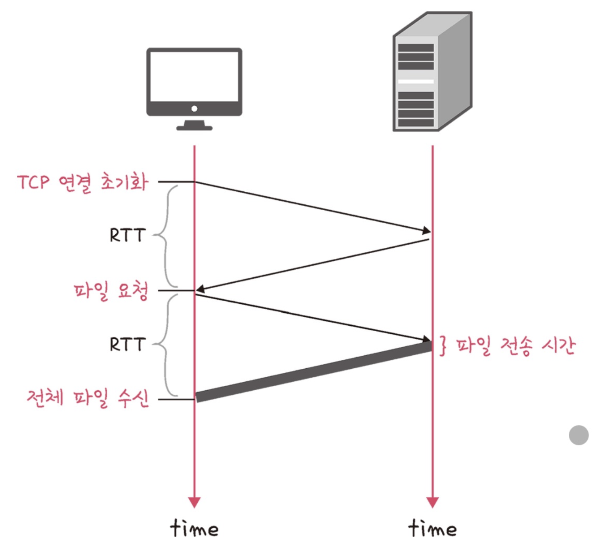

# ⚜️ HTTP ⚜️

---

웹에서 정보를 교환하기 위해 사용되는 프로토콜이다. 이 프로토콜은 클라이언트와 서버 간의 통신을 가능하게 하며, 웹 브라우저(클라이언트)가 인터넷을 통해 웹 서버로부터 웹 페이지와 다른 웹 리소스를 요청하고 받는 방식을 정의한다.

---

### ☝ **HTTP/1.0**

1996년에 공식적으로 RFC 1945로 발표된 Hypertext Transfer Protocol(HTTP)의 초기 버전 중 하나. 이 버전은 웹 통신에 대한 기본적인 프레임워크와 규칙을 설정하여, 웹 서버와 클라이언트 간의 데이터 교환을 표준화했다.
무상태(Stateless) 프로토콜로 설계되었으며, 연결 당 한 개의 요청만 처리할 수 있다.

**RTT 증가**

> HTTP/1.0 프로토콜의 설계와 작동 방식은 실제로 네트워크에서의 지연 시간, 특히 RTT(Round Trip Time)를 증가시킬 수 있는 요소를 내포하고 있다.

RTT는 데이터 패킷이 송신자로부터 수신자에게 전달되고, 다시 송신자에게 응답이 돌아오는 데 **걸리는 총 시간**을 말한다. 이 시간은 네트워크의 효율성과 웹 페이지 로딩 시간에 직접적인 영향을 미친다.

- **RTT의 증가 왜? 어디서?**

  "비연결성"이라는 특징을 가지고 있다. 이는 각 HTTP 요청마다 새로운 TCP 연결을 생성하고, 요청이 완료된 후 연결을 즉시 종료한다는 것을 의미한다. TCP 연결을 설정하고 종료하는 과정에서는 3-웨이 핸드셰이크와 연결 해제 과정이 수반되며, 이들 각각은 추가적인 RTT를 발생시킨다.

  또한, 한 번의 연결에 하나의 HTTP 요청만을 처리할 수 있다. 이는 웹 페이지를 로드할 때 필요한 다수의 리소스(이미지, 스타일시트, 자바스크립트 파일 등) 각각에 대해 별도의 연결을 요구하게 된다. 결과적으로, 하나의 웹 페이지를 완전히 로드하기 위해 발생하는 RTT의 총합은 매우 커질 수 있다.

  각 TCP 연결의 시작과 끝에는 핸드셰이크와 연결 종료 과정이 있다. 특히, TCP 연결을 시작할 때 필요한 3-웨이 핸드셰이크는 SYN 패킷을 보내고, SYN-ACK를 받고, ACK를 다시 보내는 과정으로 이루어지며, 이 모든 과정에서 RTT가 증가한다.

- 당시에는 **이미지 스플리팅, 코드 압축, 이미지 Base64 인코딩**을 사용하여 RTT 증가를 최소화했다.

---

### ☝ **HTTP/1.1**

HTTP/1.1에서는 지속적인 연결(persistent connections)과 파이프라이닝(pipelining) 기능을 도입하여, 하나의 연결을 통해 여러 개의 HTTP 요청과 응답을 처리할 수 있게 되었다. 이는 연결 설정의 오버헤드를 크게 줄이고, 전체적인 RTT를 감소시키는 효과를 가져왔다.
그러나 HTTP/1.1도 몇 가지 문제점을 지니고 있는데, 대표적으로 **Head-of-Line (HOL) Blocking 현상**과 **무거운 헤더 구조**가 있다.

**HTTP/1.0 vs. HTTP/1.1**

### HOL(Head-of-Line) Blocking

> HOL Blocking은 한 연결에서 여러 요청을 동시에 처리할 때 발생하는 문제이다. HTTP/1.1은 하나의 TCP 연결을 통해 여러 요청을 순차적으로 보낼 수 있도록 파이프라이닝을 지원하지만, 이 요청들은 응답이 도착한 순서대로 처리된다. 이는 첫 번째 요청의 응답이 지연되면, 후속 요청의 응답도 그 처리를 기다려야 한다는 것을 의미한다. 이러한 성질 때문에, 하나의 느린 요청이 여러 다른 요청의 처리를 지연시킬 수 있다.
>

**HOL Blocking**

---

### ☝ **HTTP/2**

한 연결에서 여러 요청과 응답을 동시에 처리할 수 있는 멀티플렉싱 기능을 제공하여 HOL Blocking을 해소한다. 또한, 헤더 압축을 통해 반복적인 헤더 데이터의 전송 크기를 줄여 네트워크 효율성을 개선한다. 이러한 기능은 특히 복잡한 웹 애플리케이션과 모바일 환경에서 성능 향상을 가져올 수 있다.

### 멀티플렉싱

> 하나의 TCP 연결을 통해 여러 개의 요청과 응답 메시지를 **동시에 교환**할 수 있게 하는 기능이다. HTTP/1.1에서는 하나의 연결에서 요청과 응답이 순차적으로 처리되어야 했기 때문에, 여러 리소스를 요청할 때 각 요청이 완료될 때까지 기다려야 했다. 이로 인해 발생하는 Head-of-Line Blocking 문제를 멀티플렉싱이 해결했다.
>

**멀티플렉싱**

멀티플렉싱을 통해 브라우저는 단일 TCP 연결을 통해 여러 요청을 동시에 보낼 수 있으며, 서버는 이를 동시에 처리하고 응답을 할 수 있다. 이는 네트워크 리소스의 활용도를 크게 향상시켜 페이지 로드 시간을 줄인다.

**HTTP/1.1 vs. HTTP/2**

### 헤더 압축

> HPACK(허프만 코딩 압축 알고리즘)이라는 특수 압축 포맷을 사용하여 HTTP 헤더를 압축한다. 이는 HTTP/1.1에서 헤더 정보가 매 요청마다 반복되어 전송되었던 문제를 개선한다. 헤더 압축을 통해 클라이언트와 서버는 이전에 사용되었던 헤더 필드를 저장하고, 이후 같은 정보를 전송할 때 참조 인덱스만 보내면 되므로 전송해야 할 데이터의 양이 크게 줄어들게 되었.다.
>

**HPACK을 통한 헤더 압축**

### 서버 푸시

> 서버 푸시 기능은 서버가 클라이언트의 요청을 명시적으로 받기 전에 클라이언트에게 필요할 리소스를 미리 보낼 수 있게 한다. 예를 들어, 웹 페이지를 요청할 때 HTML 파일뿐만 아니라 해당 페이지에 필요한 CSS 파일이나 JavaScript 파일, 이미지 등도 함께 보내어 브라우저의 추가 요청 없이 리소스를 받을 수 있다.
>

**서버 푸시**

서버 푸시는 웹 페이지의 의존 리소스를 빠르게 로딩하여 사용자에게 더 빠른 페이지 렌더링을 제공할 수 있게 해 준다. 그러나 이 기능은 **서버가 클라이언트의 캐시 상태를 알지 못하므로, 이미 캐시된 리소스를 다시 전송할 위험**이 있다. 따라서 효율적인 사용을 위해 서버와 클라이언트 간의 조율이 필요하다. ~~(걍 트레이드 오프다)~~

---

### ☝ **HTTPS**

웹 통신의 보안을 강화하기 위해 설계된 프로토콜이다. 기본적인 HTTP 프로토콜에 SSL(Secure Sockets Layer) 또는 TLS(Transport Layer Security) 보안 프로토콜을 추가하여 데이터의 암호화, 인증, 무결성을 제공한다.

### SSL/TLS (Secure Sockets Layer/Transport Layer Security)

> 인터넷 상의 데이터 전송을 보호하기 위해 설계된 암호화 프로토콜이다. 이 프로토콜들은 데이터의 기밀성, 무결성 및 인증을 제공하여 안전한 통신을 가능하게 한다. TLS는 SSL의 후속 버전으로, 더 강화된 보안 기능을 제공한다.
>

**SSL/TLS를 이용한 인터셉터 방지**

- **주요 기능**

  **암호화 기능** → 통신하는 양쪽 당사자 간의 데이터를 암호화하여 제3자가 데이터를 도청하는 것을 방지한다. (보통 SHA-256 으로 암호화)

  **인증 기능** → 디지털 인증서를 사용하여 통신하는 당사자의 정체를 확인한다. 웹 서버의 경우, 신뢰할 수 있는 인증 기관(CA)으로부터 발급받은 인증서를 클라이언트에 제공하여 서버의 신뢰성을 증명한다.

  **데이터 무결성** → 메시지 인증 코드(MAC)를 사용하여 데이터 패킷의 무결성을 검증한다. 이는 데이터가 전송 중에 변경되거나 손상되지 않았음을 보장한다.

- **작동 원리: 핸드셰이크 → 키 교환 → 데이터 전송 → 세션 종료**

🗒️ **CA (Certificate Authorities)**

- **디지털 인증서를 발급하고 관리하는 기관**으로 이들 기관은 개인, 회사, 기기의 공개 키와 신원 정보를 검증하고, 이 정보를 디지털 인증서에 포함시켜 발행함으로써 인증서 소유자의 신뢰성을 보증한다.
- CA의 역할은 인터넷 보안 인프라에서 중요하며, 전자 상거래, 온라인 뱅킹, 기타 중요한 데이터를 보호하는 데 필수적이다.

🗒️ **SHA-256 (Secure Hash Algorithm)**

- 데이터 또는 메시지의 무결성을 검증하기 위해 널리 사용되는 **암호 해시 함수 중 하나**이다. 이는 SHA-2 (Secure Hash Algorithm 2) 패밀리에 속하며, 미국 국립표준기술연구소(NIST)에 의해 개발되었다.
- SHA-256은 256비트(32바이트) 길이의 해시 값을 생성하며, 데이터의 작은 변화라도 해시 값에 큰 변화를 일으켜 데이터가 조작되었는지 여부를 효과적으로 감지할 수 있다.

---

### ☝ **HTTP/3**

HTTP 프로토콜의 최신 버전으로, 주로 성능 향상과 특히 연결 설정 시 지연 시간을 감소시키는 것을 목표로 한다. HTTP/3는 이전 버전과는 다르게 TCP 대신 QUIC 프로토콜을 사용한다. QUIC는 구글에 의해 개발되었으며, UDP를 기반으로 하는 프로토콜이다. 이 변경은 특히 네트워크 지연과 패킷 손실이 큰 환경에서 HTTP/3의 성능을 크게 향상시킨다.

**UDP 기반인 HTTP/3**

- **HTTP와 QUIC**

  HTTP/3는 QUIC 프로토콜을 사용하여 데이터를 전송한다. QUIC은 연결 초기 설정에 필요한 라운드 트립을 최소화한다. 예를 들어, QUIC은 TCP의 3-웨이 핸드셰이크와 TLS 핸드셰이크를 **하나의 단계로 결합**하여 초기 연결 설정 시의 지연을 줄인다.

  

  **RTT의 혁신적 감소**

  QUIC은 이전 세션의 정보를 재활용하여 **0-RTT 연결을 지원**한다. 이는 클라이언트가 서버로 데이터를 보내기 시작하는 데 필요한 시간을 제거하여, 웹 페이지의 로딩 시간을 단축시킬 수 있다. 또한, 신규 연결의 경우에는 1-RTT만으로도 데이터 전송이 가능하게 한다.

  QUIC은 스트림 레벨에서 **멀티플렉싱을 제공**하여, 여러 데이터 스트림을 동시에 독립적으로 전송할 수 있다. 이는 하나의 스트림에 문제가 발생해도 다른 스트림에 영향을 주지 않으며, 전체 연결의 효율성을 향상시킨다.

  패킷 손실 감지와 복구를 개선하여, 네트워크 조건이 좋지 않을 때도 성능 저하 또한 최소화 한다. TCP와 달리, QUIC은 전송 경로의 변경에도 연결을 유지하고 빠르게 복구할 수 있다.

---