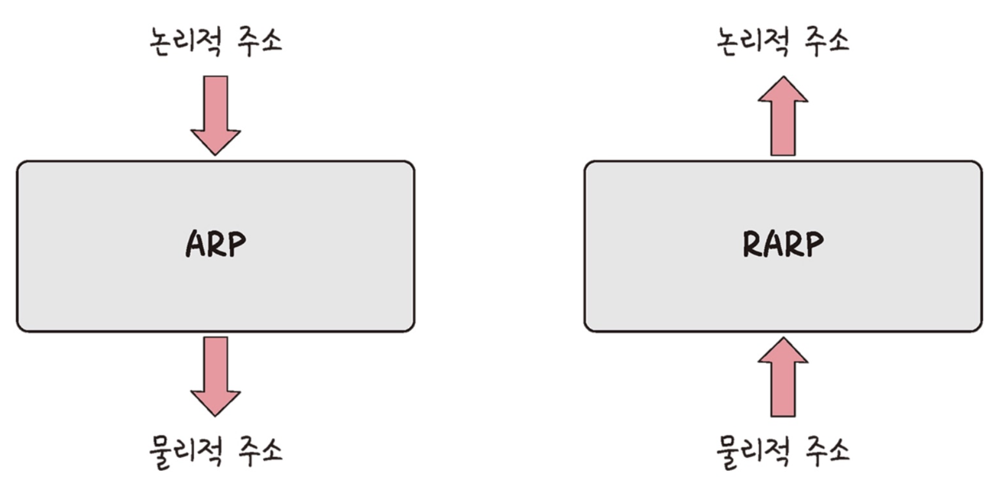

# ⚜️ IP 주소 ⚜️

네트워크상에서 컴퓨터나 다른 디바이스를 식별하기 위해 사용되는 고유한 주소이다. 이 주소는 인터넷과 같은 TCP/IP 네트워크에서 각 장치를 구별하고, 데이터 패킷이 올바른 목적지로 전송될 수 있도록 경로를 지정하는 데 필수적인 역할을 한다.

---

### ☝ **ARP**

### ARP (Address Resolution Protocol)

> IP 주소를 해당하는 MAC 주소로 변환하는 프로토콜이다. 네트워크상의 각 장치는 IP 주소를 사용하여 논리적으로 식별되지만, 실제 데이터는 물리적 네트워크를 통해 MAC 주소를 사용하여 전송된다. ARP는 이러한 IP 주소와 MAC 주소 간의 매핑을 가능하게 하여, 올바른 장치로 데이터를 전송할 수 있도록 돕는다.
>

**ARP / RARP**

- **ARP 요청**

  장치 A가 장치 B에 데이터를 보내고자 할 때, 먼저 장치 B의 MAC 주소를 알아야 한다. 만약 ARP 테이블(ARP 캐시)에 해당 IP 주소의 MAC 주소가 저장되어 있지 않다면, 장치 A는 네트워크상의 모든 장치에게 ARP 요청 패킷을 브로드캐스트한다. 이 ARP 요청 패킷은 "이 IP 주소를 가진 장치의 MAC 주소가 무엇인가요?"라는 메시지를 포함하고 있다.

- **ARP 응답**

  네트워크상의 모든 장치는 이 ARP 요청 패킷을 받지만, 해당 IP 주소를 가진 장치 B만이 응답한다. 장치 B는 자신의 MAC 주소를 포함하는 ARP 응답 패킷을 장치 A에게 유니캐스트로 보낸다.

- **캐싱**

  장치 A는 장치 B로부터 받은 MAC 주소를 자신의 ARP 테이블에 저장한다. 이 정보는 향후 동일한 IP 주소로 데이터를 전송할 때 재사용될 수 있다.

🗒️ **브로드캐스트 (Broadcast)**

- 송신 호스트 → 모든 호스트에게 전송

🗒️ **유니캐스트 (Unicast)**

- 1:1 전송

---

### ☝ **홉바이홉 통신**

> 네트워크에서 데이터 패킷이 출발지에서 목적지까지 각 중간 라우터 또는 **네트워크 노드를 거치면서 전달되는 방식**을 말한다. 이 용어는 패킷이 한 노드에서 다음 노드로, 즉 한 홉에서 다음 홉으로 **순차적으로 이동한다는 개념**을 나타낸다. 각 홉에서는 라우터가 패킷을 받아 목적지까지의 최적 경로의 다음 지점으로 패킷을 전달하는 역할을 한다.
>

**홉바이홉 통신**

### 라우팅 테이블

> 라우터나 컴퓨터 시스템 내에 있는 데이터베이스로, 네트워크 패킷이 목적지까지 도달하기 위해 따라야 할 **경로 정보를 저장**하고 있다. 라우팅 테이블은 네트워크의 다양한 목적지에 대한 정보와 그 목적지까지 도달하는 데 사용할 수 있는 경로, 그리고 각 경로의 특성을 나타내는 메트릭을 포함한다.
>

### 게이트 웨이

> 다른 네트워크 간에 데이터를 전달하는 역할을 하는 네트워크 노드 또는 장치이다. 흔히, 네트워크의 출입구로 비유되곤 하는데, 이는 게이트웨이가 다른 네트워크 프로토콜을 사용하는 **네트워크 시스템 간의 인터페이스 역할**을 하기 때문이다. 게이트웨이는 데이터의 포맷, 속도, 프로토콜 등을 변환하여, 한 네트워크의 데이터를 다른 네트워크가 이해할 수 있도록 만들어 준다.
>

**게이트웨이**

---

### ☝ **IP 주소 체계**

### IPv4

> 32비트 주소 체계를 사용하며, 일반적으로 네 개의 10진수로 표현된다. 각 10진수는 0부터 255 사이의 값을 가지며, 점으로 구분된다.
(예: 192.168.1.1)
>
- 약 43억 개의 고유 주소를 제공하지만, 인터넷의 급속한 성장으로 인해 **주소가 부족해지는 문제**가 발생했다.

### IPv6

> IPv4의 주소 부족 현상을 해결하기 위해 도입된 새로운 IP 주소 체계로, 128비트 주소 체계를 사용한다. IPv6 주소는 보통 여덟 개의 16진수 그룹으로 표현되며, 각 그룹은 콜론으로 구분된다.
(예: 2001:0db8:85a3:0000:0000:8a2e:0370:7334)
>
- 거의 **무한에 가까운** 주소 할당을 가능하게 하여, 인터넷의 지속적인 성장을 지원할 수 있다.

**IPv4 vs. IPv6**

### 클래스 기반 할당 방식 (Classful Network Addressing)

> IP 네트워크 주소를 클래스로 나누는 방식으로  IP 주소의 공간을 효율적으로 사용하려는 초기 시도로, 각 클래스가 고정된 네트워크와 호스트 부분을 가지고 있어 네트워크 운영자가 주소를 할당할 때 더 예측 가능하고 구조화된 방식을 제공했다.
>

**클래스 기반 할당 방식**

**클래스 범위**

- **클래스 기반 할당 방식의 한계**

  클래스 기반 할당 방식의 가장 큰 문제는 **IP 주소 공간의 비효율적인 사용과 유연성 부족**이었다. 예를 들어, Class A 네트워크는 매우 큰 조직만이 필요로 하는 너무 많은 호스트 주소를 할당받는 반면, Class C는 작은 네트워크에는 적합하지만 조금만 규모가 커져도 여러 개의 Class C 주소가 필요했다. 이로 인해 IP 주소의 낭비가 심각해졌다.

  이러한 문제를 해결하기 위해 1993년에 CIDR(Classless Inter-Domain Routing)이 도입되었다. CIDR은 고정된 클래스를 없애고, 변수 길이의 **서브넷 마스크를 사용**하여 네트워크 주소를 할당한다. 이 방식은 주소 공간을 더 유연하게 사용할 수 있게 하여, 인터넷의 성장을 더욱 효과적으로 지원한다.

### DHCP (Dynamic Host Configuration Protocol)

> 네트워크 장치들이 자동으로 IP 주소와 기타 네트워크 구성을 받을 수 있도록 하는 프로토콜이다. DHCP는 네트워크에 새로운 장치가 연결될 때마다 수동으로 IP 주소를 할당하는 번거로움을 없애고, 네트워크 관리자가 중앙에서 장치들의 네트워크 구성을 관리할 수 있도록 해준다.

DHCP의 작동 과정을 DORA 프로세스라고 한다. (Discover, Offer, Request, Acknowledgement)

### NAT → 조금 더 공부

> 네트워크 주소를 변환하는 기술로, 주로 **사설 IP 주소와 공용 IP 주소 간의 변환**을 위해 사용된다. 이 기술은 하나의 공용 IP 주소를 여러 개의 사설 IP 주소가 공유할 수 있게 하여, IP 주소를 절약하고 인터넷 연결을 보다 효율적으로 관리할 수 있도록 한다.
>

**NAT**

- **NAT의 기능**
    - 인터넷에서 사용 가능한 IPv4 주소가 한정적이기 때문에, NAT는 사설 네트워크 내의 여러 장치가 단일 또는 소수의 공용 IP 주소를 공유하여 인터넷에 접속할 수 있게 한다. **→ IP 주소 절약**
    - 내부 네트워크와 외부 네트워크 간에 일종의 방화벽 역할을 하여, 외부로부터의 직접적인 접근을 차단한다. 외부 사용자는 내부 네트워크의 특정 장치에 대한 사설 IP 주소를 알 수 없으므로, 네트워크의 보안이 강화된다. **→ 보안 강화**
    - 내부 네트워크에서 발생하는 모든 인터넷 트래픽을 처리하고, 적절한 사설 IP 주소로 트래픽을 라우팅하여 효율적인 데이터 흐름을 관리한다. **→ 트래픽 라우팅 관리**

---