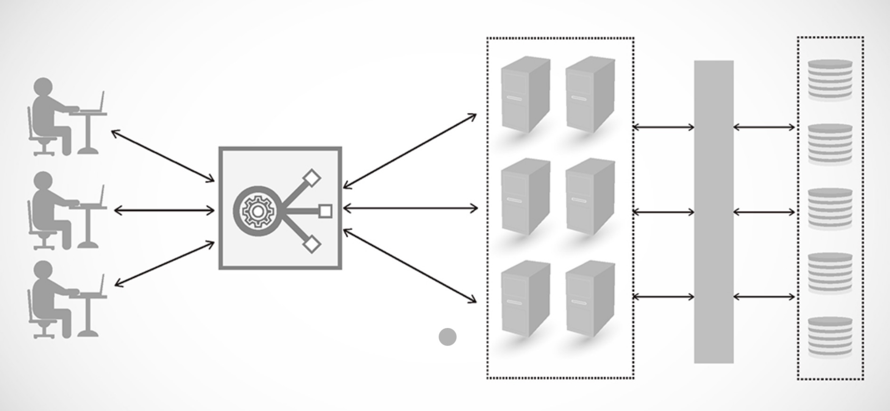

# ⚜️ 네트워크 기기 ⚜️

---

네트워크에서 사용되는 다양한 기기들은 데이터의 처리와 통신을 위해 특정 네트워크 계층에서 작동한다. 각 기기의 작동 범위를 이해하는 것은 네트워크의 설계와 문제 해결에 중요하다.

### 허브 (Hub)

> 허브는 네트워크 내의 모든 장치에 데이터를 전기적 신호로 브로드캐스트한다. 허브는 데이터를 보내는 소스나 목적지를 구분하지 않고, 연결된 모든 포트로 데이터를 재전송한다.
>
- **물리 계층 (OSI 모델의 1계층)**

### 게이트웨이 (Gateway)

> 게이트웨이는 서로 다른 네트워크 아키텍처나 프로토콜을 사용하는 네트워크 간에 데이터를 변환, 전송하는 역할을 한다. 예를 들어, 이메일 시스템 간의 통신이나 서로 다른 데이터 포맷을 사용하는 시스템 간의 데이터 전송에 사용된다.
>
- **응용 계층 (OSI 모델의 7계층)**

### 방화벽 (Firewall)

> 방화벽은 네트워크 보안 장치로, 인가되지 않은 접근으로부터 네트워크를 보호한다. 방화벽은 들어오고 나가는 네트워크 트래픽을 모니터링하고 제어하며, 정책에 따라 트래픽을 허용하거나 차단한다.
>
- **네트워크 계층 (3계층) 및 전송 계층 (4계층), 때에 따라 응용 계층 (7계층)**

---

### ☝ **애플리케이션 계층을 처리하는 기기**

### L7 스위치

> OSI 모델의 응용 계층에서 작동하는 네트워크 장치로, 일반적으로 '콘텐츠 스위치' 또는 '로드 밸런서'라고도 불린다. 이 장치는 네트워크 트래픽을 효율적으로 관리하고 분배하기 위해, 데이터 패킷 내의 응용 계층 데이터(즉, 실제 콘텐츠)를 분석하여 라우팅 결정을 내린다.
>

**L7 스위치**

- L7 스위치는 네트워크 트래픽을 관리하고, 서버 간에 트래픽을 균등하게 분산시킨다. 이는 웹 서버, 응용 프로그램 서버 등의 부하를 경감시켜 서비스의 가용성과 신뢰성을 높이는 데 도움이 된다. **→ 트래픽 관리 및 분산**
- 사용자 세션 정보를 기반으로 특정 사용자의 요청을 동일한 서버로 라우팅하여, 세션 일관성을 유지한다. 이는 온라인 쇼핑, 금융 거래 등에서 중요한 역할을 한다. **→ 세션 유지**
- L7 스위치는 HTTP 헤더, URL, 쿠키 등의 정보를 분석하여, 특정 요청을 가장 적절하게 처리할 수 있는 서버로 라우팅한다. 예를 들어, 비디오 콘텐츠 요청과 텍스트 콘텐츠 요청을 다른 서버로 분리할 수 있다. **→ 콘텐츠 기반 라우팅**

🗒️ **L4 스위치**

- L7 스위치와 **기능 자체는 비슷하지만, 전송 계층을 처리하는 기기**이다. (IP와 포트를 기반으로 트래픽을 분산)
- AWS에서의 L7 스위치 → **ALB** / L4 스위치 → **NLB**

### 로드 밸런서 (Load Balancer)

> 네트워크, 서버, 또는 어플리케이션 간에 **작업량을 분산**시켜 전체 시스템의 효율성, 용량, 안정성을 향상시키는 기술이다. 이를 통해 어떤 특정 서버에 과부하가 집중되는 것을 방지하고, 사용자 요청에 대한 응답 시간을 개선하며, 전반적인 서비스의 가용성을 높일 수 있다. **→ 트래픽 분산, 고가용성 및 장애 복구, 확장성**
>

**로드밸런서의 서버 이중화**

---

### ☝ **인터넷 계층을 처리하는 기기**

### 라우터 (Router)

> 라우터는 IP 주소를 사용하여 다양한 네트워크 간의 데이터 패킷을 라우팅한다. 라우터는 네트워크의 경계에서 작동하여 다른 네트워크로 데이터 패킷을 전달하는 데 사용되며, 경로 결정 및 트래픽 관리 기능을 수행한다.
>

**라우터**

### L3 스위치

> 데이터 링크 계층(L2)과 네트워크 계층(L3)의 기능을 결합한 네트워크 장비이다. 이 장치는 전통적인 L2 스위칭 기능에 **라우팅 기능을 추가**하여, 하나의 장치에서 두 계층의 역할을 수행할 수 있게 해준다. 이를 통해 네트워크의 효율성을 높이고, 구성의 복잡성을 줄일 수 있다.
>

**L3 스위치 vs. L2 스위치**

- 기본적으로 레이어 2 기능을 수행하며, MAC 주소를 기반으로 내부 네트워크의 트래픽을 스위칭한다. 이는 데이터 패킷을 네트워크 내의 올바른 목적지로 빠르게 전달하는 역할을 한다. **→ 스위칭**
- IP 주소를 사용하여 라우팅 결정을 내린다. 이는 여러 서브넷 간의 트래픽을 관리하고, 필요에 따라 다른 네트워크로 패킷을 전달할 수 있게 해준다. **→ 라우팅**
- ACLs (Access Control Lists)과 같은 보안 기능을 제공하여, 특정 트래픽을 허용하거나 거부할 수 있다. 이는 네트워크 보안을 강화하고, 민감한 데이터의 접근을 제어하는 데 중요하다. **→ 보안**
- 트래픽 관리와 QoS 기능을 통해 음성, 비디오 등의 실시간 데이터 트래픽에 우선순위를 부여하고, 네트워크 자원을 효과적으로 배분할 수 있다. **→ 품질 보장**

---

### ☝ **데이터 링크 계층을 처리하는 기기**

### 브릿지 및 L2 스위치 (Bridge & L2 Switch)

> 브리지와 스위치는 네트워크 장치들 사이에서 **MAC 주소를 사용하여 트래픽을 필터링하고 전달**한다. 이들은 네트워크 내에서 데이터 흐름을 효율적으로 관리하여 충돌 도메인을 줄이고 성능을 향상시킨다. 스위치는 여러 포트를 가지고 있어 다수의 장치와 통신할 수 있으며, 각 포트는 독립적인 충돌 도메인을 형성한다.
>

**L2 스위치**

**브릿지**

---

### ☝ **물리 계층을 처리하는 기기**

### NIC (Network Interface Card)

> 컴퓨터나 다른 디지털 장치를 네트워크에 연결하기 위한 하드웨어 장치이다. NIC는 물리적 매체(예: 이더넷 케이블, 광섬유, 무선 신호)를 통해 **데이터를 전송하고 수신하는 기능을 수행**한다. 이 장치는 일반적으로 컴퓨터의 마더보드에 내장되어 있거나, 확장 카드 형태로 제공되어 PCI 또는 PCIe 슬롯에 설치된다.
>

**NIC**

### 리피터 (Repeater)

> 리피터는 신호를 감지하여 그 강도를 증폭시키고 재전송함으로써 네트워크의 신호 범위를 확장한다.
~~(요새는 광케이블 써서 잘 안씀)~~
>

**리피터**

### AP (Access Point)

**→ 패킷 복사기기 (LAN 연결 후 다른 장치에서 무선 LAN 기술을 사용하여 무선 네트워크 연결을 할 수 있음)**

---