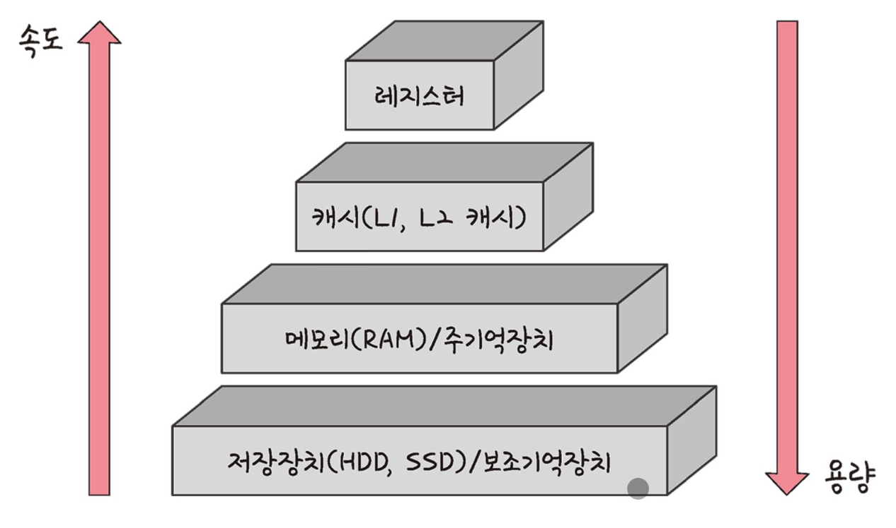

# ⚜️ 메모리 ⚜️

> 메모리는 컴퓨터 시스템에서 **데이터를 저장하고 읽는 데 사용되는 하드웨어 장치**이다.
컴퓨터의 작동에 필수적인 구성 요소로, 프로그램 실행과 데이터 처리를 위한 임시 저장 공간을 제공한다.
메모리는 크게 주기억장치(RAM, ROM)와 보조기억장치(HDD, SDD, 외부 저장 장치)로 나눌 수 있다.
>

### ☝ **메모리 계층**

> 컴퓨터 시스템에서 사용되는 다양한 유형의 메모리를 **성능과 용량에 따라 계층적으로 배치한 구조**를 의미한다. 이 계층 구조는 비용과 속도 사이의 균형을 맞추기 위해 설계되었으며, 각 계층은 특정한 역할을 수행한다. 상위 계층일수록 속도가 빠르고 용량이 적으며, 하위 계층일수록 속도가 느리고 용량이 크다.
>

**메모리 계층**

- **레지스터 (Register)**

  CPU 내부에 있는 매우 빠른 메모리로, 현재 **실행 중인 명령어와 관련된 데이터**를 저장한다.
  용량이 매우 작지만, 접근 속도가 가장 빠르다.

- **캐시 (Cache)**

  CPU와 주기억장치(RAM) 사이에 위치한 고속 메모리로, **자주 사용되는 데이터를 저장**하여 CPU가 빠르게 접근할 수 있도록 한다. 계층 구조로 나뉘며, 일반적으로 L1, L2, L3 캐시로 구성된다.

    - **L1 캐시 →** CPU 코어에 내장된 가장 빠른 캐시로, 용량이 가장 작다.
    - **L2 캐시 →** L1 캐시보다 크지만 속도는 약간 느리다.
    - **L3 캐시 →** 여러 CPU 코어가 공유하는 캐시로, L1과 L2보다 크지만 느리다.
- **주기억장치 (Primary)**
    - **램 (RAM, Random Access Memory) →** 현재 실행 중인 프로그램과 데이터를 저장하는 **휘발성 메모리**이다.

  용량이 캐시보다 크고, 속도는 캐시보다 느리지만 여전히 빠르다.

- **보조기억장치 (Secondary)**
    - **하드 디스크 드라이브 (HDD) →** **큰 용량을 제공하는 비휘발성 메모리**로, 접근 속도가 느리다.
    - **솔리드 스테이트 드라이브 (SSD) →** 플래시 메모리를 사용하여 **빠른 접근 속도를 제공하는 비휘발성 메모리**로, HDD보다 빠르다.

  보조기억장치는 데이터를 영구적으로 저장하는 역할을 한다.

메모리 계층 구조는 속도와 비용의 균형을 맞추기 위해 고안되었다.

CPU는 가장 빠른 레지스터와 캐시를 먼저 사용하고, 필요한 데이터가 캐시에 없는 경우 주기억장치(RAM)에서 데이터를 가져온다.

만약 RAM에서도 데이터를 찾을 수 없다면, 보조기억장치(HDD 또는 SSD)에서 데이터를 가져온다.

### 캐시 (Cache)

> 컴퓨터 시스템에서 자주 사용되는 데이터를 임시로 저장하여 빠르게 접근할 수 있도록 하는 고속 메모리이다. 캐시는 주기억장치(RAM)보다 빠르며, CPU와 메모리 사이에 위치하여 데이터 접근 속도를 높이고 시스템 성능을 향상시키는 역할을 한다.
>

매우 빠른 속도로 데이터를 읽고 쓸 수 있다. 이는 CPU가 데이터를 빠르게 접근하여 처리 속도를 높일 수 있도록 한다.

하지만 용량이 제한적이며, 주로 가장 자주 사용되는 데이터를 저장한다.

여러 계층으로 나뉘며, 각 계층은 다른 속도와 용량을 가지는데, 일반적으로 L1, L2, L3 캐시로 구성된다.

- **캐시의 작동원리**

  

  **캐시 히트와 캐시 미스**

    - **캐시 히트**

      CPU가 필요한 데이터가 캐시에 존재하면, 이를 “캐시 히트”라고 한다.
      캐시 히트가 발생하면 CPU는 빠르게 데이터를 가져와 사용할 수 있다.

    - **캐시 미스**

      CPU가 필요한 데이터가 캐시에 없으면, 이를 “캐시 미스”라고 한다.
      캐시 미스가 발생하면 CPU는 주기억장치(RAM)에서 데이터를 가져와야 하며, 이 과정에서 지연이 발생한다.
      가져온 데이터는 캐시에 저장되어 이후 접근이 더 빠르게 이루어질 수 있다.

    - **캐시  일관성**

      멀티코어 시스템에서는 각 코어가 자신의 캐시를 가지고 있기 때문에, 데이터의 일관성을 유지하는 것이 중요하다. 이를 위해 캐시 일관성 프로토콜(예: MESI 프로토콜)이 사용되어 데이터가 각 캐시 간에 일관되게 유지되도록 한다.

- 예시: Redis에서의 개싱 계층 아키텍쳐

  

🗒️ **캐시 매핑**

- 주기억장치(RAM)의 데이터 블록을 캐시에 어떻게 배치할지를 결정하는 방법을 의미한다.
- 캐시 매핑 방식에 따라 메모리 주소가 캐시의 특정 위치와 연결되고, 이는 캐시의 효율성과 성능에 큰 영향을 미친다.
- 주요 캐시 매핑 방식에는 직접 매핑, 완전 연결 매핑, 집합 연관 매핑이 있다.

**캐시 매핑 분류**

🗒️ **캐시 매핑**

- **웹사이트가 사용자의 웹 브라우저에 저장하는 작은 데이터 조각**이다.
- 웹 사이트가 사용자를 인식하고, 사용자 세션을 유지하며, 개인화된 사용자 경험을 제공하기 위해 사용된다.
- 일반적으로 이름, 값, 만료 날짜, 경로 및 도메인 등의 정보를 포함한다.

🗒️ **로컬 스토리지**

- 웹 브라우저에서 제공하는 클라이언트 측 저장소로, **사용자가 웹 애플리케이션을 통해 생성한 데이터를 브라우저에 영구적으로 저장할 수 있는 공간**을 제공한다.
- 로컬 스토리지는 HTML5 표준의 일부로 도입되었으며, 쿠키와 달리 만료 날짜가 없고 데이터가 명시적으로 삭제되기 전까지 브라우저에 영구적으로 저장된다.

🗒️ **세션 스토리지**

- 웹 브라우저에서 제공하는 클라이언트 측 저장소로, **사용자 세션 동안 데이터를 임시로 저장하는 공간**이다.
- 세션 스토리지는 HTML5 표준의 일부로 도입되었으며, 각 브라우저 탭이나 창마다 독립된 저장소를 제공한다.
- 브라우저 탭이나 창을 닫으면 세션 스토리지에 저장된 데이터는 자동으로 삭제된다.

---

### ☝ **메모리 관리**

### 가상 메모리 (Virtual Memory)

> 컴퓨터 시스템에서 실제 물리적 메모리(RAM)의 용량보다 **더 큰 주소 공간**을 사용할 수 있도록 하는 메모리 관리 기법이다. 이를 통해 프로그램이 사용할 수 있는 메모리 공간을 확장하고, 물리적 메모리 자원을 효율적으로 활용할 수 있다.
>

- **주소 공간 분리**

  가상 메모리는 **각 프로세스에 독립적인 가상 주소 공간을 제공**하여, 프로세스 간의 메모리 충돌을 방지한다.
  가상 주소는 실제 물리적 메모리 주소와 다르며, 운영체제가 이를 관리한다.

- **페이징 (Paging)**

  가상 메모리는 페이징 기법을 통해 구현된다. 이는 **메모리를 일정한 크기의 페이지로 나누고, 각 페이지를 물리적 메모리의 프레임에 매핑하는 방식**이다.
  페이지 테이블(Page Table)은 가상 주소와 물리적 주소 간의 매핑 정보를 저장한다.

- **페이지 폴트 (Page Fault)**

  프로그램이 접근하려는 가상 주소에 해당하는 페이지가 **물리적 메모리에 없을 때 발생하는 예외 상황**이다.
  페이지 폴트가 발생하면 운영체제는 필요한 페이지를 디스크(일반적으로 스왑 영역 또는 페이지 파일)에서 물리적 메모리로 로드한다.

- **스왑 공간 (Swap Space)**

  물리적 메모리가 부족할 때, 운영체제는 사용하지 않는 페이지를 디스크의 스왑 공간에 저장한다.
  스왑 공간은 물리적 메모리와 유사하게 동작하지만, 접근 속도가 느리다.

✅ **가상 메모리의 작동 원리**

- **주소 변환 (Address Translation)**

  CPU는 가상 주소를 사용하여 메모리에 접근한다. 가상 주소는 페이지 테이블을 통해 물리적 주소로 변환된다. 주소 변환 과정은 메모리 관리 장치(MMU, Memory Management Unit)가 담당한다.

- **페이지 테이블 (Page Table)**

  가상 주소와 물리적 주소 간의 매핑 정보를 저장하는 데이터 구조이다.
  각 프로세스는 고유한 페이지 테이블을 가지며, 페이지 테이블은 가상 페이지 번호와 물리적 프레임 번호를 매핑한다.

- **TLB (Translation Lookaside Buffer)**

  **최근 사용된 가상 주소와 물리적 주소 간의 매핑 정보를 캐시하는 고속 메모리**이다.
  주소 변환 속도를 향상시킬 수 있다. TLB 미스가 발생하면 페이지 테이블을 참조하여 매핑 정보를 가져온다.

- **페이지 폴트 (Page Fault) 처리**

  페이지 폴트가 발생하면 운영체제는 해당 페이지를 디스크에서 물리적 메모리로 로드한다.
  필요한 페이지를 메모리로 로드한 후, 페이지 테이블을 업데이트하고 프로세스 실행을 재개한다.

### 스레싱 (Thrashing)

> 컴퓨터 시스템에서 가상 메모리를 사용할 때, 페이지 폴트가 너무 자주 발생하여 CPU가 실제 작업을 수행하는 대신 페이지 교체 작업에 대부분의 시간을 소비하는 현상을 말한다. 이는 시스템 성능을 극도로 저하시킬 수 있다.
>

해결 방법으로는 다음과 같은 방법들이 있다.

- **프로세스 수 조절** → 동시에 실행되는 프로세스 수를 줄여 각 프로세스가 충분한 메모리를 사용할 수 있도록 한다.
- **작업 세트 크기 관리** → 프로세스의 작업 집합 크기를 줄여, 필요한 페이지들이 물리적 메모리에 적재될 수 있도록 한다.
- **물리적 메모리 증설** → 시스템에 더 많은 물리적 메모리를 추가하여, 더 많은 페이지를 메모리에 적재할 수 있도록 한다.
- **페이지 교체 알고리즘 개선** → 더 효율적인 페이지 교체 알고리즘을 사용하여, 페이지 폴트 빈도를 줄인다.
- **가상 메모리 설정 최적화** → 스왑 공간 크기와 위치를 최적화하여 디스크 I/O 부하를 줄인다.
- **PFF (Page Fault Frequency)** → 페이지 폴트 빈도를 조절하는 방법으로 상한선과 하한선을 만들어 프레임을 조절한다.

### 메모리 할당

> 프로그램이 실행되는 동안 필요한 메모리를 효과적으로 관리하고 배분하는 과정으로 효율적 자원 사용과 시스템 안정성을 보장하기 위해 필수적인 작업이다. 이 과정은 주기억장치(RAM)와 가상 메모리의 관리와 관련이 있다.
>

✅ **메모리 할당의  기본 개념**

- **주소 공간**

  **물리적 주소 공간 →** 실제 하드웨어 메모리 주소.

  **가상 주소 공간 →** 각 프로세스에 대해 독립적으로 제공되는 주소 공간.

- **페이징 (Paging)**

  메모리를 **고정된 크기의 페이지**로 나누어 관리하는 기법
  가상 메모리의 페이지를 물리적 메모리의 프레임에 매핑한다.
  페이지 테이블(Page Table)을 통해 가상 주소를 물리적 주소로 변환한다.

- **세그멘테이션 (Segmentation)**

  메모리를 **가변 크기의 세그먼트**로 나누어 관리하는 기법
  각 세그먼트는 논리적 단위(코드, 데이터, 스택 등)를 의미
  세그먼트 테이블(Segment Table)을 사용하여 가상 주소를 물리적 주소로 변환한다.

- **메모리 할당 전략**
    - **연속 할당**

      

      프로세스에 연속된 메모리 블록을 할당하는 방식
      단순하지만 **외부 단편화(External Fragmentation)**가 발생할 수 있다.

    - **불연속(분산) 할당**

      프로세스가 여러 비연속 메모리 블록을 사용할 수 있게 하는 방식
      페이징과 세그멘테이션이 이에 해당
      외부 단편화를 줄이고 메모리 활용도를 높인다.

    - **고정 분할**

      메모리를 고정된 크기의 블록으로 나누어 각 블록에 프로세스를 할당
      관리가 용이하지만 **내부 단편화(Internal Fragmentation)**가 발생할 수 있다.

    - **가변 분할**

      프로세스가 필요한 만큼 메모리를 할당받고, 블록 크기는 가변적
      외부 단편화 문제가 발생할 수 있으며, 이를 해결하기 위해 **압축(Compaction)**을 사용할 수 있다.

      

      **가변 분할 방식 종류**

      🗒️ **외부 단편화**

        - 메모리를 나눈 크기보다 프로그램이 **커서** 들어가지 못하는 공간이 많이 발생하는 현상

        🗒️ **내부 단편화**

        - 메모리를 나눈 크기보다 프로그램이 **작아서** 들어가지 못하는 공간이 많이 발생하는 현상

### 페이지 교체 알고리즘

> 가상 메모리 시스템에서 페이지 폴트가 발생할 때, 어떤 페이지를 물리적 메모리에서 제거할지를 결정하는 방법이다. 이는 물리적 메모리(프레임)가 한정된 상황에서 중요한 역할을 하며, 효율적인 페이지 교체 알고리즘은 시스템 성능을 크게 향상시킬 수 있다.
>
- **오프라인 알고리즘 (Offline Algorithm)**

  **미래에 가장 오랫동안 사용되지 않을 페이지를 교체**

  이론적으로 가장 효율적이지만, 미래의 메모리 접근 패턴을 예측할 수 없기 때문에 실제 시스템에서는 구현이 불가능하다. 다른 알고리즘의 성능 평가 기준으로 사용된다.

- **FIFO (First-In-First-Out)**

  **가장 먼저 메모리에 적재된 페이지를 교체**

  구현이 간단하지만, 페이지가 오래 사용된 정도와 상관없이 교체되므로 비효율적일 수 있다.

- **LRU (Least Recently Used)**

  **가장 오랫동안 사용되지 않은 페이지를 교체**

  최근 사용된 페이지는 앞으로도 사용될 가능성이 높다는 가정에 기반한다.
  효율적이지만, 사용 이력을 추적하기 위해 추가적인 하드웨어 지원이 필요할 수 있다.

  

- **NUR (Not Used Recently)**

  참조 비트와 수정 비트(Dirty Bit)를 사용하여 페이지를 네 가지 클래스(참조/수정 여부)로 분류한다.
  **참조되지 않고 수정되지 않은 페이지를 우선적으로 교체**

  구현이 간단하지만, LRU보다 덜 효율적일 수 있다.

  

- **LFU (Not Frequently Used)**

  **가장 적게 사용된 페이지를 교체**

  사용 빈도가 낮은 페이지를 교체하여, 자주 사용되는 페이지는 계속 메모리에 유지한다.
  오래된 빈도 데이터가 반영되어 비효율적일 수 있다.

- **클럭 알고리즘 (Clock Algorithm)**

  LRU의 근사 알고리즘으로, **원형 버퍼(클럭)와 비트(참조 비트)를 사용하여 페이지를 교체**

  참조 비트가 0인 페이지를 교체하며, 1인 페이지는 0으로 설정하고 다음 페이지를 검사한다.
  성능과 구현의 균형이 잘 맞는 알고리즘이라고 할 수 있다.

---