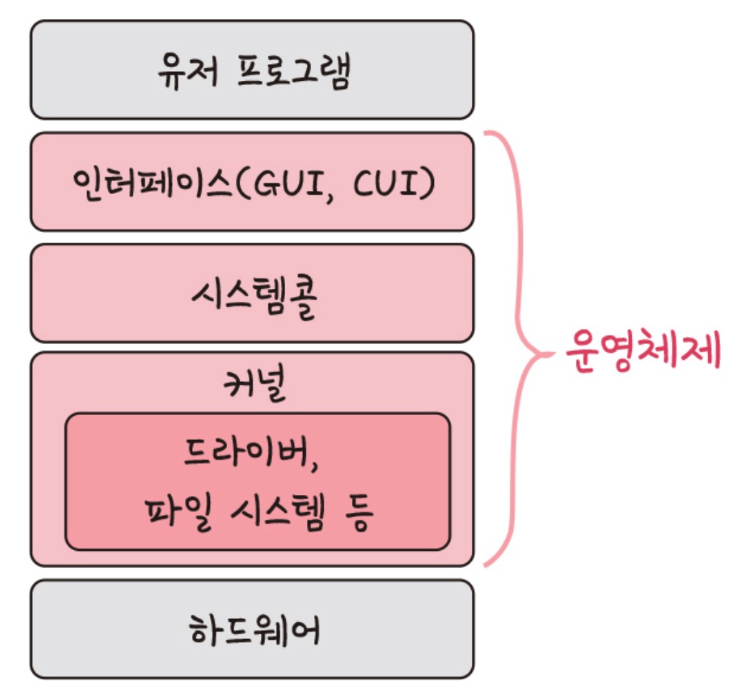

# ⚜️ 운영체제와 컴퓨터 ⚜️

### ☝ **운영체제의 역할과 구조**

### 운영체제의 역할

> 컴퓨터 하드웨어와 소프트웨어 자원을 관리하고, 컴퓨터 프로그램이 실행되는 환경을 제공하는 시스템 소프트웨어이다. 운영체제는 사용자와 컴퓨터 하드웨어 간의 중재자로서 중요한 역할을 하며, 여러 가지 핵심 기능을 수행한다.

OS는 **중간자 역할**을 한다고 말할 수 있다. 사용자 입장에서는 하드웨어의 이용과 성능을 편리하게 해주는 프로그램이고, 시스템 입장에서는 CPU, memory, I/O  디바이스 등의 자원을 총괄하는 프로그램인 것이다. 가장 기초적인 OS의 목적은 프로그램을 실행하고, 유저의 문제를 쉽게 풀 수 있도록 만드는 것에 있다.

- **CPU 스케줄링과 프로세스 관리**

  여러 프로그램이 동시에 실행될 수 있도록 프로세스를 생성, 스케줄링, 종료하는 역할을 한다.

  각 프로세스의 실행 상태를 관리하고, CPU 시간을 효율적으로 분배한다.

- **메모리 관리**

  프로그램들이 사용하는 메모리를 관리한다.

  각 프로그램이 사용하는 메모리 영역을 할당하고 해제하며, **가상 메모리 기법**을 통해 실제 물리적 메모리보다 큰 메모리 공간을 사용할 수 있게 한다.

- **파일 시스템 관리**

  파일과 디렉터리를 관리하고, **데이터의 저장과 접근을 담당**한다.

  파일 시스템을 통해 데이터가 하드 드라이브, SSD 등 저장 매체에 효율적으로 저장되고 검색될 수 있도록 한다.

- **장치 관리**

  컴퓨터에 연결된 다양한 **하드웨어 장치를 관리**한다.

  프린터, 디스크 드라이브, 키보드 등 장치와의 통신을 처리하고, 장치 드라이버를 통해 하드웨어와 소프트웨어 간의 인터페이스를 제공한다.

### 운영체제 구조

**운영체제의 구조**

- **커널 (Kernel)**

  가장 중요한 것은 커널이다. 커널은 용어 자체도 '핵심의' 같은 의미이다.

  운영체제 커널이라고 하면, **전반적인 프로세스**를 뜻한다.

  프로세스 관리, 메모리 관리, 저장공간 관리, 연결된 장치 관리 등 컴퓨터에 속한 모든 자원을 관리하는 역할을 한다. 
    
- **인터페이스 (Interface)**

                                                                     인터페이스는 사용자의 명령을 컴퓨터에 전달하고 결과를 사용자에게 알려주는 **소통의 역할**을 한다.

                                                                     인터페이스는 대표적으로 2가지 종류가 있다.

                                                                     GUI(Graphical User Interface)와 CLI(Command Line Interface)다.

                                                                     GUI는 윈도우 바탕화면처럼 아이콘과 마우스 클릭이 되게끔 만들어져서 사용자 편의성을 가진 인터페이스다.

                                                                     CLI는 터미널로 연결하면, 마우스가 없고 명령어를 키보드로 입력하면 글씨만 나오는 인터페이스다.(ex. MS-DOS).

- **시스템 콜 (System Call)**

  시스템 콜은 사용자나 프로그램이 직접적으로 컴퓨터 자원에 접근하는 것을 막고 **커널을 보호하기 위해서** 만든 코드 집합이다. 시스템 콜 함수를 통해 커널에 접근할 수 있다.

  커널이라는 굉장히 중요한 여러가지 코드나 중요한 내용이 있는데, 그걸 아무나 접근할 수 있게 만들면, 중요한 걸 누가 바꾸거나 할 수 있게 때문에 운영체제는 시스템 콜을 통해서만 호출할 수 있게 디자인 되어있다.

  

  **시스템콜**

  응용 프로그램이 운영체제의 커널 기능을 사용할 수 있도록 하는 **인터페이스**로서 사용자 모드에서 실행되는 프로그램이 운영체제의 보호된 커널 모드로 전환하여, 커널에서 제공하는 서비스를 요청하는 메커니즘이다.

  시스템 콜은 운영체제와 응용 프로그램 간의 통신 수단으로, 하드웨어 자원에 대한 접근, 파일 시스템 조작, 프로세스 관리, 네트워킹 등 다양한 기능을 수행할 수 있게 한다.

    
    🗒️ **modebit**

    - CPU 상태를 나타내는 레지스터에 포함된 비트
    - 이 비트는 현재 실행 중인 코드가 사용자 모드에서 실행 중인지 커널 모드에서 실행 중인지를 나타냄
    - 시스템 콜을 통해 사용자 모드에서 커널 모드로 전환할 때, 이 모드 비트가 변경됨

  

  **modebit의 역할**

    

- **드라이버 (Driver)**

  드라이버는 프린터, 키보드 및 디스크 드라이브와 같은 **하드웨어 장치와 운영체제 간의 통신을 가능하게 하는 소프트웨어**이다.

  몇년 전만해도 컴퓨터에 새로운 기기를 연결하기 위해 드라이버를 설치했어야했던 걸 알고있다면, 이해하기 쉽다.

  프린터라고 하는 기계는 컴퓨터가 일반적으로 이해하는 구조랑 좀 다르게 생겼다. 특수한 목적을 가지고 있는 하드웨어이기 떄문이다. 그래서 드라이버를 설치함으로써 그 디바이스와 소통을 할 수 있게 만들어주는 것이다.

---

### ☝ **컴퓨터의 요소**

**컴퓨터의 요소**

### CPU (Central Processing Unit)

> 컴퓨터의 핵심적인 구성 요소로, **컴퓨터 시스템에서 모든 계산과 데이터 처리를 담당하는 장치**이다.
CPU는 프로그램 명령어를 해석하고 실행하여, 다양한 작업을 수행하며 컴퓨터의 두뇌 역할을 한다.
주로 연산 장치(ALU, Arithmetic Logic Unit), 제어 장치(CU, Control Unit), 그리고 레지스터로 구성되어 있다.
>
- **연산 장치 (ALU)**
    - 산술 연산(덧셈, 뺄셈, 곱셈, 나눗셈)과 논리 연산(AND, OR, NOT 등)을 수행한다.
    - 데이터 처리의 핵심 부분으로, CPU가 명령어를 실행할 때 실제 연산이 이루어지는 곳이다.
- **제어 장치 (CU)**
    - 명령어의 해석 및 실행을 담당한다.
    - 프로그램의 명령어를 가져와서 해석한 후, ALU와 다른 컴퓨터 구성 요소들이 어떻게 동작해야 하는지를 지시한다.
    - 명령어 사이클(인출, 해석, 실행)의 각 단계를 조정한다.
- **레지스터 (Register)**
    - 고속의 임시 저장소로, 현재 실행 중인 명령어와 관련된 데이터를 저장한다.
    - 주요 레지스터에는 프로그램 카운터(PC), 명령어 레지스터(IR), 누산기(Accumulator) 등이 있다.
    - 레지스터는 CPU 내부에서 가장 빠르게 접근할 수 있는 메모리이다.

CPU의 동작은 주로 **명령어 사이클 (Instruction Cycle)**로 설명할 수 있다.

**`인출 (Fetch) → 해석 (Decode) → 실행 (Execute)`**

**CPU의 연산 수행의 예시**

🗒️ **인터럽트**

- 컴퓨터 시스템에서 중요한 이벤트가 발생했을 때, 현재 실행 중인 작**업을 일시 중단하고 즉시 해당 이벤트를 처리**하기 위해 사용되는 메커니즘이다.
- 하드웨어 장치나 소프트웨어에서 발생할 수 있으며, CPU가 중요한 작업을 빠르게 처리할 수 있도록 한다.
- **하드웨어 인터럽트**
    - 외부 하드웨어 장치(키보드, 마우스, 디스크 드라이브 등)가 CPU에 인터럽트 신호를 보내 발생한다.
      예: 키보드 입력, 마우스 클릭, 네트워크 패킷 수신, 타이머 이벤트 등.
- **소프트웨어 인터럽트**
    - 소프트웨어 명령에 의해 발생하는 인터럽트로, 주로 시스템 콜이나 예외 처리(exception handling)를 위해 사용된다.
      예: 시스템 콜, 산술 연산 오류(0으로 나누기), 페이지 폴트(page fault) 등.

### DMA (Direct Memory Access) 컨트롤러

> CPU의 개입 없이 직접 메모리와 주변 장치 간의 **데이터 전송을 관리**하는 하드웨어 장치이다.
DMA 컨트롤러를 사용하면 데이터 전송이 더 효율적이고 빠르게 이루어지며, CPU가 다른 작업을 수행할 수 있도록 해준다.
>

### 메모리

> 메모리는 컴퓨터 시스템에서 **데이터를 저장하고 읽는 데 사용되는 하드웨어 장치**이다.
컴퓨터의 작동에 필수적인 구성 요소로, 프로그램 실행과 데이터 처리를 위한 임시 저장 공간을 제공한다.
메모리는 크게 주기억장치(RAM, ROM)와 보조기억장치(HDD, SDD, 외부 저장 장치)로 나눌 수 있다.
>

---