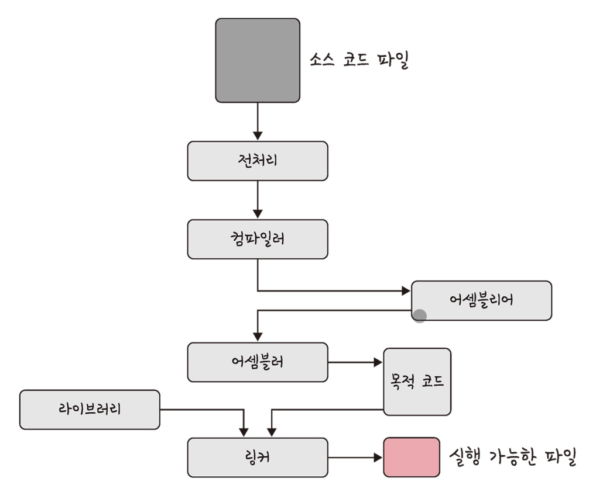

# 프로세스와 스레드

> 프로세스는 실행 중인 프로그램의 인스턴스이다. 이는 운영 체제에 의해 관리되며, 독립된 메모리 공간을 가진다. 각 프로세스는 CPU, 메모리, 파일, 디바이스 등 여러 시스템 리소스를 할당받아 실행된다. 프로세스는 다른 프로세스와 **독립적으로 실행**되며, 하나의 프로세스가 중단되더라도 다른 프로세스에 영향을 미치지 않는다.

스레드는 프로세스 내에서 실행되는 작은 실행 단위로써, 한 프로세스는 여러 개의 스레드를 가질 수 있으며, 이들은 프로세스의 메모리와 자원을 공유한다. 스레드는 병렬 처리를 가능하게 하여 프로그램의 성능을 향상시킬 수 있다. 스레드는 **같은 프로세스 내에서 독립적으로 실행**되지만, 다른 스레드와 자원을 공유하기 때문에 서로의 작업에 영향을 미칠 수 있다.
> 

---

<aside>
☝ **프로세스와 컴파일 과정**

</aside>

> 고급 프로그래밍 언어로 작성된 소스 코드를 컴퓨터가 실행할 수 있는 기계어 코드로 변환하는 과정을 의미한다.
> 

컴파일의 과정은 다음과 같다.



- **전처리 (Processing)** → 소스 코드에서 **전처리 지시문(#으로 시작하는 행)을 처리**한다. 이는 주로 매크로 확장, 파일 포함, 조건부 컴파일 등을 포함하고 있다.
- **컴파일 (Compilation)** → 전처리된 소스 코드를 **어셈블리어로 변환**한다. 이 단계에서는 구문 분석, 의미 분석, 최적화 등이 이루어진다.
    - **컴파일 과정 세부 설명**
        - **구문 분석 (Parsing)**
            
            소스 코드의 문법을 분석하여 구문 트리(Syntax Tree)를 생성한다. 이는 코드 구조를 트리 형태로 표현한 것이라고 할 수 있다.
            
        - **의미 분석 (Semantic Analysis)**
            
            구문 트리에서 의미적 오류를 검사한다. 예를 들어. 변수의 타입이 맞는지, 사용되지 않는 변수가 있는지 등을 확인한다.
            
        - **중간 코드 생성 (Intermediate Code Generation)**
            
            기계 독립적인 중간 코드를 생성한다. 이는 최적화를 쉽제하기 위해서이다.
            
        - **코드 최적화 (Code Optimization)**
            
            중간 코드나 최종 기계어 코드를 최적화하여 실행 시간을 줄이거나 메모리 사용을 줄인다.
            
        - **기계어 코드 생성 (Code Generation)**
            
            최적화된 중간 코드를 실제 실행 가능한 기계어 코드로 변환한다.
            
- **어셈블 (Assembly)** → 어셈블리어 코드를 **기계어 코드로 변환**한다. 이 과정에서 목적 파일(Object File)이 생성된다.
- **링크 (Linking)** → 여러 목적 파일과 라이브러리를 **결합하여 실행 파일을 생성**한다. 이 단계에서는 외부 함수나 변수의 주소를 해결하는 작업이 이루어진다.

---

<aside>
☝ **프로세스의 상태**

</aside>


- **생성 (New)** → 프로세스가 생성되고 있는 상태
- **준비 (Ready)** → 실행될 준비가 완료되어 CPU 할당을 기다리고 있는 상태
- **실행 (Running)** → CPU가 할당되어 실제로 실행 중인 상태
- **대기 (Waiting)** → 특정 이벤트를 기다리는 상태 (I/O 완료 같은)
- **종료 (Terminated)** → 프로세스 실행이 완료된 상태

### 상태 전이 과정

- **Dispatch (Ready → Running)**
    
    여러 프로세스들 중 한 프로세스를 선정하여 CPU에 할당하는 과정이다.
    
- **Interrupt (Running → Ready)**
    
    할당된 CPU 시간이 지나면 Time out Interrupt가 발생하여 CPU를 다른 프로세스에게 양도하고 자신은 Ready 상태로 전이되는 과정이다.
    
- **Block (Running → Waiting)**
    
    I/O 등의 자원 요청 후 즉시 할당받을 수 없어, 할당받을 때까지 기다리기 위해 Running에서 Waiting 상태로 전이되는 과정이다.
    
    I/O 처리는 CPU가 아닌 I/O 프로세스가 담당하기 때문에 Block이 발생한다.
    
- **Wake up (Waiting → Ready)**
    
    필요한 자원이 할당되면 프로세스는 Waiting에서 Ready 상태로 전이되는 과정이다.
    

프로세스는 또한 **스레드(Thread)를 포함**할 수 있다. (추후에 나옴) 

스레드는 프로세스 내에서 실행되는 작은 실행 단위로, 다중 스레드는 병렬 처리를 통해 프로그램 성능을 향상시킬 수 있습니다.

---

<aside>
☝ **프로세스의 메모리 구조**

</aside>

프로세스의 메모리 구조는 일반적으로 다음과 같이 나뉜다.


### 텍스트 영역 (Text Segment)

→ 프로그램의 기계어 코드, 읽기 전용

> 코드 영역이라고도 불리며 **실행할 프로그램의 기계어 코드가 저장되는 영역**이다. 이 영역은 읽기 전용으로, 일반적으로 수정되지 않는다. 메모리 사용을 절약하고 보안을 강화하기 위해 여러 프로세스 간에 공유될 수 있다.
> 

### 데이터 영역 (Data Segment)

→ 초기화된 전역 변수와 정적 변수

> 초기화된 전역 변수와 정적 변수가 저장된다.
> 

다음과 같이 두가지 부분으로 나뉜다.

- **초기화된 데이터 영역 (Initialized Data Segment)**
    
    초기값이 할당된 전역 변수와 정적 변수가 저장된다.
    
- **초기화되지 않은 데이터 영역 (Uninitialized Data Segment, BSS)**
    
    초기값이 없는 전역 변수와 정적 변수가 저장된다. 프로그램이 시작될 때 모두 0으로 초기화된다.
    

### 힙 영역 (Heap Segment)

→ 동적 메모리 할당, 크기가 동적으로 변경

> **동적 메모리 할당을 위해 사용되며 프로세스 실행 중에 크기가 변경**될 수 있다. 프로그램이 실행되는 동안 `malloc()`, `calloc()`, `realloc()` 등의 함수 호출을 통해 메모리를 할당 받는다. 개발자가 반드시 명시적으로 해제해야 하며, 그렇지 않을 경우 메모리 누수가 발생할 수 있다.
> 

### 스택 영역 (Stack Segment)

→ 지역 변수, 함수 매개변수, 리턴 주소, LIFO 구조

> **지역 변수, 함수 호출 시 전달되는 매개변수, 리턴 주소 등이 저장**된다. 함수가 호출될 때마다 새로운 스택 프레임이 생성되고, 함수가 종료되면 해당 스택 프레임이 제거된다. LIFO 구조로 작동하며 자동으로 관리되며, 함수 호출과 함께 스택 포인터가 조정된다.
> 

---

<aside>
☝ **PCB**

</aside>

> 프로세스 제어 블록(PCB, Process Control Block)은 운영 체제가 각 프로세스를 관리하고 추적하기 위해 사용하는 데이터 구조이다. PCB는 운영 체제에서 실행 중인 각 프로세스에 대한 중요한 정보를 저장하고 있으며, 프로세스의 상태를 유지하고 문맥 전환(**Context Switching**)을 지원하는 데 핵심적인 역할을 한다.
> 

### PCB의 구조

**프로세스 식별자 (PID, Process Identifiler)**

- 각 프로세스를 고유하게 식별하는 번호로 운영 체제가 프로세스를 관리하고 추적하는 데 사용된다.

**프로세스 상태 (Process State)**

- 프로세스의 현재 상태를 나타낸다. ~~(위에 나왔던거)~~

**프로그램 카운터 (Program Counter)**

- 다음에 실행할 명령어의 주소를 가리키며 문맥 전환 시 현재 실행 중인 명령어의 위치를 저장하고 복원한다.

**CPU 레지스터 (CPU Registers)**

- 프로세스 실행에 필요한 레지스터 값들이 저장되며 문맥 전환 시 레지스터 상태를 저장하고 복원한다.

**계정 정보 (Accounting Information)**

- 프로세스 실행 시간, CPU 사용량, 사용자 ID, 그룹 ID 등 프로세스 관련 통계 정보가 포함된다.

**입출력 상태 정보 (I/O Status Information)**

- 프로세스가 사용 중인 입출력 장치와 열린 파일에 대한 정보가 포함되며 입출력 요청과 상태를 추적한다.

**스케줄링 정보 (Scheduling Information)**

- 프로세스의 우선순위, 스케줄링 큐 포인터 등 스케줄링에 필요한 정보가 포함된다. 프로세스 스케줄러가 프로세스를 선택할 때 주로 사용된다.

**++ 메모리 관리 정보 (Memory Management Information)**

- 프로세스의 주소 공간 정보가 포함되며 페이지 테이블, 세그먼트 테이블 등 메모리 관리에 필요한 정보가 포함된다.

### 문맥 교환(Context Switching) 이란?

CPU가 현재 실행 중인 프로세스나 스레드의 상태를 저장하고, 다음에 실행할 프로세스나 스레드의 상태를 복원하는 과정이다. 이는 멀티태스킹 운영 체제에서 여러 프로세스를 동시에 실행할 수 있도록 하는 핵심 메커니즘이다.


---

<aside>
☝ **멀티프로세싱**

</aside>

> 컴퓨터 시스템에서 **여러 개의 CPU를 사용하여 동시에 여러 프로세스를 실행하는 기술을 의미**한다. 멀티프로세싱은 시스템의 처리 능력을 향상시키고, 성능을 최적화하며, 작업을 병렬로 수행함으로써 응답 시간을 단축할 수 있다. 멀티프로세싱은 일반적으로 대형 서버, 슈퍼컴퓨터, 그리고 일부 고성능 개인용 컴퓨터에서 사용된다.
> 


멀티 프로세싱

### IPC

> Inter-Process Communication의 약자로, **여러 프로세스 간에 데이터를 주고받기 위한 메커니즘**을 의미한다. 멀티 프로세싱 환경에서는 각 프로세스가 별도의 메모리 공간을 가지기 때문에, 서로 데이터를 주고받기 위해서는 특별한 방법이 필요하다. IPC는 이러한 통신을 가능하게 하는 다양한 기법과 도구를 포함한다. 예시로 클라이언트와 서버를 들 수 있다.
> 
- **공유 메모리**
    
    > 여러 프로세스가 동일한 메모리 영역을 공유하여 데이터를 주고받는 방법이다. 이를 통해 프로세스 간의 통신이 매우 빠르게 이루어질 수 있다. 공유 메모리는 운영체제에 의해 관리된다.
    > 
    
    주요 특징 → 빠른 속도, 직접 접근 가능, 동기화 필요
    
    작동 방식 → 메모리 할당, 메모리 연결, 데이터 접근, 메모리 분리, 메모리 해제
    
    ```cpp
    int shm_id = shmget(key, size, IPC_CREAT | 0666);     // 할당
    char *shared_memory = (char *)shmat(shm_id, NULL, 0); // 연결
    strcpy(shared_memory, "Hello, Shared Memory!");       // 접근
    shmdt(shared_memory);                                 // 분리
    shmctl(shm_id, IPC_RMID, NULL);                       // 해제
    ```
    
    **동기화**
    
    > 동기화는 공유 메모리 사용의 핵심 요소로, 여러 프로세스가 동시에 접근할 때 데이터의 일관성을 유지하기 위해 다음과 같은 동기화 메커니즘을 사용할 수 있다.
    > 
    - **Mutex**
        
        상호 배제를 보장하여 한 번에 하나의 프로세스만 공유 메모리에 접근할 수 있도록 한다.
        
    - **Semaphore**
        
        보다 복잡한 동기화 시나리오를 처리할 수 있다. 세마포어는 카운터를 사용하여 여러 프로세스가 공유 자원을 적절하게 사용하도록 조절한다.
        
    - **조건 변수(Condition Variable)**
        
        특정 조건이 만족될 때까지 프로세스를 대기시키고, 조건이 만족되면 다시 실행하도록 한다.
        
- **파일**
    
    > 디스크에 저장된 데이터나 파일 서버에서 제공한 데이터를 의미한다.
    > 
- **소켓**
    
    > 주로 네트워크를 통한 프로세스 간 통신에 사용되지만, 로컬 시스템의 프로세스 간 통신에도 사용될 수 있다. TCP/IP 또는 UDP 프로토콜을 사용할 수 있으며, 데이터를 스트림 형태로 전송한다.
    > 
- **파이프**
    
    > 파이프는 한 프로세스에서 다른 프로세스로 데이터를 전달하는 데 사용된다. 파이프는 양방향 또는 단방향으로 데이터를 전송할 수 있다. 익명 파이프와 명명된 파이프로 나뉘는데, 익명 파이프는 부모-자식 프로세스 간의 통신에 사용되고, 명명된 파이프는 관련 없는 프로세스 간에도 사용될 수 있다.
    > 
    
    
    
    익명 파이프
    
    
    
    명명된 파이프
    
- **메시지 큐**
    
    > 프로세스들이 메시지를 보내고 받을 수 있는 큐를 제공한다. 각 메시지는 식별자와 함께 큐에 저장된다. 복잡한 데이터 구조를 주고받는 데 유용하다.
    > 
    
    
    
    메시지 큐
    

---

<aside>
☝ **스레드와 멀티스레딩**

</aside>

### 스레드

> 스레드는 **프로세스 내에서 실행되는 독립적인 실행 흐름**을 말한다. 여러 스레드가 하나의 프로세스 내에서 실행되면, 이들을 멀티스레딩이라고 한다. 스레드는 프로세스의 자원을 공유하며, 효율적인 병렬 처리를 가능하게 한다.
> 

스레드 간의 컨텍스트 스위칭은 같은 프로세스 내의 스레들이 자원을 공유하기 때문에 프로세스 간의 컨텍스트 스위칭보다 빠르다. 스레드는 프로세스 내에서 자원을 공유하기 때문에, 프로세스 간의 스위칭에서 발생하는 오버헤드가 줄어든다.

하지만 스레드 간 자원 공유로 인해 동기화 문제가 발생할 수 있다. 따라서 동기화 문제를 해결하기 위해 뮤텍스, 세마포어, 조건 변수 등의 동기화 메커니즘을 사용해야 한다.

또한, 멀티스레드 프로그램은 디버깅이 어렵고, 경쟁 상태(race condition)와 데드락(deadlock) 같은 문제가 발생할 수 있다.


스레드

### 공유자원과 임계 영역

> 여러 스레드가 동시에 접근하고 사용할 수 있는 자원을 의미한다. 이러한 자원은 메모리의 특정 영역(예: 전역 변수, 힙 영역의 동적 메모리), 파일 디스크립터, 소켓, 장치 등 다양한 형태가 될 수 있다. 공유 자원을 안전하고 효율적으로 사용하기 위해서는 동기화 메커니즘이 필요하다.
> 

**공유 자원의 종류**로는

- **메모리 자원**
    
    전역 변수 및 정적 변수: 모든 스레드가 접근할 수 있는 변수
    힙 메모리 → `malloc`이나 `new`를 통해 동적 할당된 메모리
    
- **파일 및 입출력 자원**
    
    파일 디스크립터 → 파일에 대한 접근을 여러 스레드가 동시에 할 수 있다.
    소켓 → 네트워크 통신을 위해 사용되며, 여러 스레드가 동일한 소켓을 사용할 수 있다.
    
- **데이터 구조**
    
    링크드 리스트, 큐, 스택 등의 데이터 구조는 여러 스레드가 동시에 접근할 수 있다.
    

**공유 자원을 사용하게 되면 다음과 같은 문제가 생긴다.**

- **경쟁 상태 (Race Condition)**
    
    두 개 이상의 스레드가 동시에 자원에 접근하고 변경할 때, 실행 순서에 따라 결과가 달라지는 문제이다.
    
- **데드락 (Deadlock)**
    
    두 개 이상의 스레드가 서로 자원을 점유한 채 다른 스레드가 점유한 자원을 기다리면서 무한히 대기하는 상태이다.
    
- **라이블락 (Livelock)**
    
    두 개 이상의 스레드가 서로의 진행을 방해하지 않으면서도 계속해서 다른 스레드의 작업을 방해하며 실행을 반복하는 상태이다.
    
- **기아 상태 (Starvation)**
    
    특정 스레드가 자원에 접근하지 못하고 계속해서 대기하는 상태입니다.
    

**동기화 메커니즘**

- **Mutex** → 상호 배제를 보장하여 한 번에 하나의 스레드만 자원에 접근할 수 있게 한다.
    
    ```cpp
    pthread_mutex_t mutex;
    pthread_mutex_init(&mutex, NULL);
    
    pthread_mutex_lock(&mutex);
    // 공유 자원 접근
    ...
    pthread_mutex_unlock(&mutex);
    
    pthread_mutex_destroy(&mutex);
    ```
    
    
    
- **Semaphore** → 카운터를 사용하여 여러 스레드가 제한된 자원에 접근할 수 있도록 조절한다. (바이너리, 카운팅 등이 있음)
    
    ```cpp
    sem_t semaphore;
    sem_init(&semaphore, 0, 1);
    
    sem_wait(&semaphore);
    // 공유 자원 접근
    ...
    sem_post(&semaphore);
    
    sem_destroy(&semaphore);
    ```
    
    
    
- **조건 변수** → 특정 조건이 만족될 때까지 스레드를 대기시키고, 조건이 만족되면 다시 실행한다.
    
    ```cpp
    pthread_cond_t cond;
    pthread_mutex_t mutex;
    
    pthread_cond_init(&cond, NULL);
    pthread_mutex_init(&mutex, NULL);
    
    pthread_mutex_lock(&mutex);
    while (!condition) {
        pthread_cond_wait(&cond, &mutex);
    }
    // 조건이 만족됨
    pthread_mutex_unlock(&mutex);
    
    pthread_cond_signal(&cond);
    
    pthread_cond_destroy(&cond);
    pthread_mutex_destroy(&mutex);
    ```
    
- **읽기-쓰기 잠금** → 읽기 접근이 다수일 때는 여러 스레드가 동시에 읽을 수 있지만, 쓰기 접근이 있을 때는 단독으로 접근하게 한다.
    
    ```cpp
    pthread_rwlock_t rwlock;
    pthread_rwlock_init(&rwlock, NULL);
    
    pthread_rwlock_rdlock(&rwlock);
    // 읽기 접근
    pthread_rwlock_unlock(&rwlock);
    
    pthread_rwlock_wrlock(&rwlock);
    // 쓰기 접근
    pthread_rwlock_unlock(&rwlock);
    
    pthread_rwlock_destroy(&rwlock);
    ```
    

---

<aside>
☝ **Deadlock**

</aside>

> **여러 프로세스나 스레드가 서로 자원을 점유한 채 다른 스레드나 프로세스가 점유하고 있는 자원을 기다리면서, 아무것도 진행하지 못하고 무한히 대기하는 상태**를 말한다. 데드락은 병행 프로그래밍 및 운영체제에서 중요한 문제 중 하나다.
> 

**데드락의 발생 조건**은 다음과 같다. **(Coffman 조건)**

- **상호 배제 (Mutual Exclusion)**
    
    자원은 한 번에 하나의 프로세스만 사용할 수 있다. 즉, 자원을 공유할 수 없다.
    
- **점유 대기 (Hold and Wait)**
    
    자원을 점유한 프로세스가 다른 자원을 기다리는 동안에도 이미 점유한 자원을 놓지 않고 계속 점유하고 있다.
    
- **비선점 (No Preemption)**
    
    이미 할당된 자원을 강제로 해제할 수 없다. 자원은 점유한 프로세스가 자발적으로 해제해야 한다.
    
- **환형 대기 (Circular Wait)**
    
    자원을 기다리는 프로세스 간에 순환 대기 형태가 존재한다. 예를 들어, 프로세스 A가 프로세스 B의 자원을 기다리고, 프로세스 B가 프로세스 C의 자원을 기다리고, 프로세스 C가 다시 프로세스 A의 자원을 기다리는 상태이다.
    

**데드락의 해결 방법**은 다음과 같다.

- **예방 (Prevention)**
    
    Coffman 조건 중 하나를 제거하여 데드락이 발생하지 않도록 한다.
    상호 배제 조건을 제거할 수는 없으므로, 주로 점유 대기, 비선점, 환형 대기 조건을 제거하는 방법을 사용한다.
    
    - **점유 대기 조건 제거 →** 프로세스가 자원을 요청하기 전에 모든 자원을 할당받도록 하거나, 자원을 요청할 때 이미 점유한 자원을 해제하도록 합니다.
    - **비선점 조건 제거 →** 자원을 점유한 프로세스가 다른 자원을 요청할 때, 이미 점유한 자원을 강제로 해제하게 합니다.
    - **환형 대기 조건 제거 →** 자원에 순서(우선순위)를 부여하고, 항상 증가하는 순서로 자원을 요청하게 합니다.
- **회피 (Avoidance)**
    
    시스템이 안전 상태를 유지하도록 자원의 할당을 동적으로 관리한다.
    대표적인 방법으로는 은행원 알고리즘(Banker's Algorithm)이 있다. 이 알고리즘은 시스템이 자원을 할당할 때, 현재 상태가 안전한지 검사하여 안전한 경우에만 자원을 할당한다.
    
    [[OS] 교착상태 회피방법: 은행원 알고리즘(Banker's Algorithm)](https://star7sss.tistory.com/939)
    
- **탐지 및 회복 (Detection and Recovery)**
    
    데드락이 발생할 가능성을 허용하고, 주기적으로 시스템 상태를 검사하여 데드락을 탐지한다.
    데드락이 탐지되면 이를 회복하기 위한 조치를 취한다. 예를 들어, 데드락을 해결하기 위해 프로세스를 강제로 종료하거나, 일부 자원을 회수하여 다른 프로세스에 할당할 수 있다.
    
- **상황별 해결 (Ad-Hoc)**
    
    프로그램 논리나 특정 알고리즘을 사용하여 데드락을 방지하거나 회피한다. 이는 주로 응용 프로그램 수준에서 구현된다.
    

---